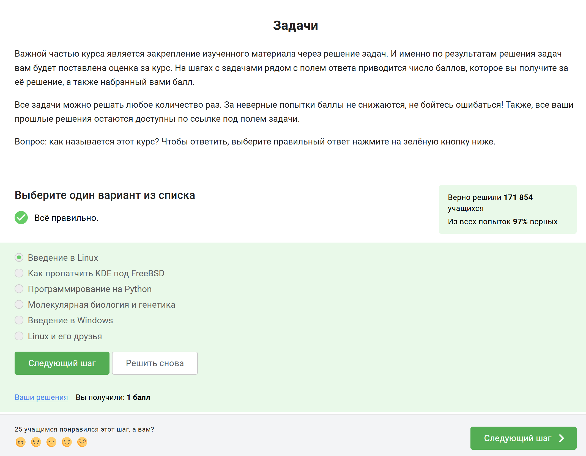
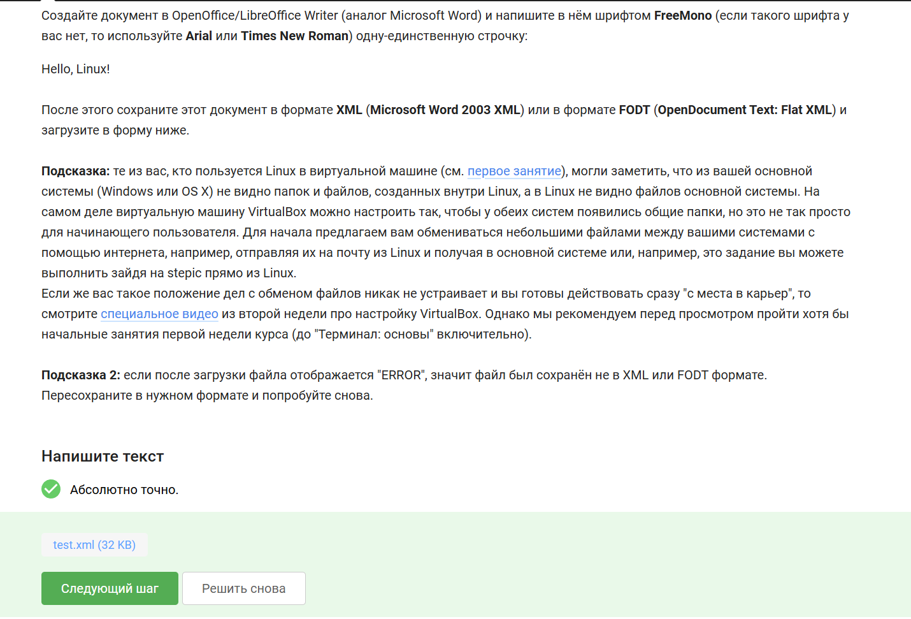

````markdown
---
title: "Отчет по первому разделу внешнего курса"
subtitle: "Введение"

author:
  - name: "Лопатченко Полина Андреевна"
    degrees: "Студент"
    orcid: "0000-0002-0877-7063"
    email: "1032253529@rudn.ru"
    affiliation: "Российский университет дружбы народов"

date: 2026-04-26
date-format: "YYYY-MM-DD"

lang: ru

format:
  html:
    toc: true
    number-sections: true
    embed-resources: true
    fig-responsive: true

  pdf:
    documentclass: article
    pdf-engine: xelatex
    mainfont: "DejaVu Serif"
    geometry:
      - margin=2cm
    fontsize: 12pt
    toc: true
    number-sections: true
    fig-pos: "H"

execute:
  echo: false
---

# Информация

## Докладчик

|  |  |
|---|---|
| **ФИО** | Лопатченко Полина Андреевна |
| **Статус** | Студент |
| **Группа** | НКАбд-04-25 |
| **Университет** | Российский университет дружбы народов им. П. Лумумбы |
| **Email** | 1032253529@rudn.ru |
| **Сайт** | https://PALopatchenko-lab.github.io/ru/ |

{ width=35% fig-align="center" }

# Цель и задачи

**Цель:** пройти первый этап внешнего курса «Введение в Linux» и закрепить базовые навыки работы в Linux.

## Задачи

- изучить общие сведения о курсе и установке Linux;
- освоить базовые команды терминала;
- разобраться со стандартными потоками ввода и вывода;
- изучить основные приёмы скачивания файлов;
- рассмотреть работу с архивами;
- выполнить задания по поиску файлов и текста.

# Что такое Linux и зачем нужен терминал

Linux — это семейство Unix-подобных операционных систем.

Терминал позволяет:

- выполнять команды напрямую;
- управлять файлами и каталогами;
- запускать программы;
- работать со стандартными потоками;
- быстро автоматизировать типовые действия.

Именно поэтому в курсе большое внимание уделяется командной строке.

# Что изучалось на первом этапе

В ходе первого этапа были рассмотрены следующие темы:

- общая информация о курсе;
- установка и запуск Linux;
- базовые сведения о пакетах и программах;
- терминал и основные команды;
- ввод, вывод и перенаправление потоков;
- скачивание файлов с помощью `wget`;
- работа с архивами;
- поиск файлов и строк в текстах.

# Общая информация о курсе

На начальном этапе были выполнены вводные задания:

- определено название курса;
- изучены правила прохождения курса;
- подтверждён запуск Linux на компьютере.

| Выбор названия курса | Выбор утверждений о прохождении курса |
|---|---|
| { width=90% } | { width=90% } |

# Как установить и запустить Linux

Также были рассмотрены базовые вопросы, связанные с установкой Linux и использованием виртуальной машины.

В результате было отмечено:

- какие операционные системы используются обычно;
- что виртуальная машина позволяет запускать одну ОС внутри другой;
- что Linux был успешно запущен на компьютере.

# Осваиваем Linux

На этом этапе были выполнены простые практические задания:

- создан текстовый документ в LibreOffice Writer;
- определено расширение пакетов в Ubuntu — `deb`;
- установлен VLC и найден нужный автор;
- рассмотрены возможности Update Manager.

# Пример практического задания

Одним из заданий было создание документа со строкой `Hello, Linux!`, сохранение его в нужном формате и загрузка на платформу.

{ width=75% fig-align="center" }

# Terminal: основы

В разделе, посвящённом терминалу, были изучены основные понятия и команды:

- `pwd` — вывод текущего каталога;
- `ls` — просмотр содержимого каталога;
- `rm -r` — удаление каталогов;
- `&`, `Ctrl+Z`, `bg` — работа с фоновыми процессами.

Также были выполнены задания на понимание путей, опций команд и поведения программ в терминале.

# Основные идеи раздела Terminal

В ходе выполнения заданий было установлено, что:

- команды Linux чувствительны к регистру;
- один и тот же результат можно получить разными способами;
- длинные и короткие опции команд могут быть эквивалентны;
- относительные и абсолютные пути позволяют обращаться к одним и тем же каталогам;
- запуск программы с `&` переводит её в фоновый режим.

# Пример задания по работе в терминале

В одном из заданий нужно было найти полную эквивалентную запись команды `ls` с длинными опциями.

Было установлено, что команда

```bash
ls -A --human-readable -l /some/directory
```

эквивалентна команде

```bash
ls -lAh /some/directory
```

{ width=55% fig-align="center" }

# Ввод и вывод

Отдельный раздел курса был посвящён стандартным потокам.

Были рассмотрены:

- поток обычного вывода `stdout`;
- поток ошибок `stderr`;
- перенаправление в файл с помощью `>`;
- добавление в файл с помощью `>>`;
- перенаправление ошибок через `2>` и `2>>`;
- поведение `stderr` в конвейере.

# Основные выводы по вводу и выводу

В ходе выполнения заданий было установлено, что:

- по умолчанию поток ошибок выводится на экран;
- ошибки можно отдельно записывать в файл;
- в конвейере автоматически передаётся только `stdout`;
- `stderr` остаётся отдельным потоком и без перенаправления продолжает выводиться на экран.

# Скачивание файлов из интернета

В этом разделе рассматривалась утилита `wget`.

Были изучены её возможности:

- сохранение файла под нужным именем;
- подавление служебных сообщений через `-q`;
- рекурсивное скачивание;
- фильтрация скачиваемых файлов по расширению.

Также были выполнены задания на понимание работы опций:

- `-O`;
- `-P`;
- `-q`;
- `-r`;
- `-l`;
- `-A`.

# Работа с архивами

В разделе по архивам рассматривались программы:

- `gzip`;
- `zip`;
- `tar`.

Были изучены различия между ними, а также определено:

- какие программы могут архивировать каталоги;
- какие опции нужны для создания архива `tar.bz2`.

Например, для создания архива вида `my_archive.tar.bz2` в `tar` используется набор опций:

```bash
tar -cjf my_archive.tar.bz2 folder/
```

# Поиск файлов и слов в файлах

Последний раздел был посвящён поиску.

В нём были выполнены задания:

- по маскам команды `find`;
- по поиску строк через `grep`;
- по созданию файла с результатами поиска;
- по использованию перенаправления вывода.

Это позволило закрепить работу с шаблонами, регистром символов и поиском текста в наборах файлов.

# Пример задания на поиск текста

Одним из практических заданий был поиск всех строк со словом `love` в произведениях Шекспира с сохранением результата в файл `answer.txt`, после чего файл был загружен на платформу.

| Поиск строк со словом love | Загрузка файла answer.txt |
|---|---|
| { width=95% } | { width=95% } |

# Результаты прохождения этапа

По итогам выполнения первого этапа были закреплены следующие навыки:

- работа с базовыми командами Linux;
- понимание относительных и абсолютных путей;
- использование стандартных потоков и перенаправления;
- скачивание файлов из интернета;
- работа с архивами;
- поиск файлов и строк в текстовых файлах.

Таким образом, первый этап курса сформировал основу для дальнейшего изучения Linux.

# Выводы

В ходе выполнения работы был пройден первый этап внешнего курса «Введение в Linux».

В процессе прохождения этапа были изучены базовые теоретические сведения и выполнены практические задания по работе с терминалом, вводом и выводом, скачиванием файлов, архивами и поиском текста.
````
