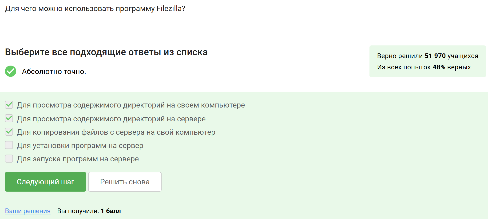
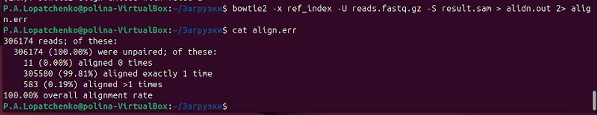
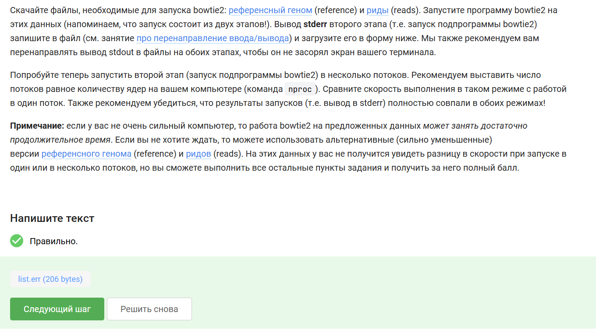
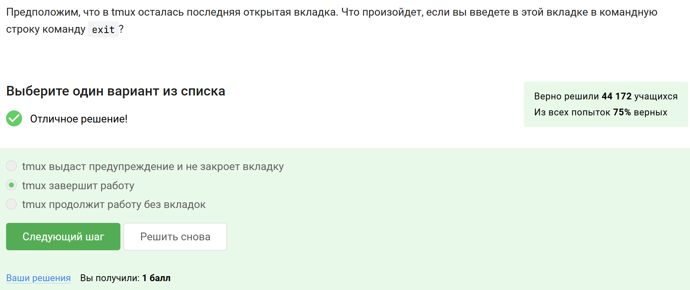
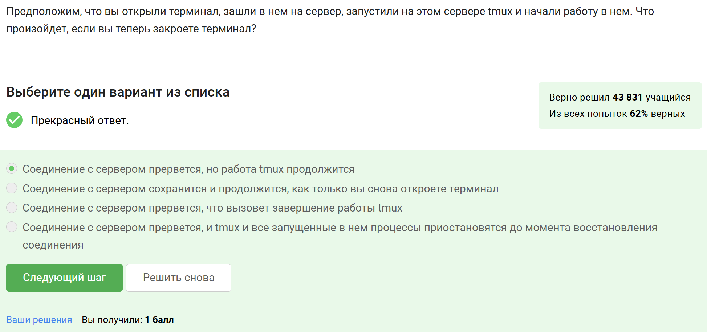
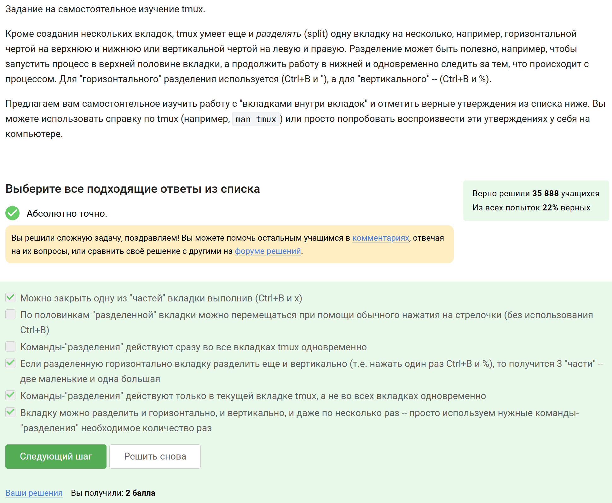

---
## Author
author:
  name: Лопатченко Полина Андреевна
  degrees: Студент
  orcid: 0000-0002-0877-7063
  email: 1032253529@rudn.ru
  affiliation:
    - name: Российский университет дружбы народов
      country: Российская Федерация
      postal-code: 117198
      city: Москва
      address: ул. Миклухо-Маклая, д. 6
## Title
title: Второй этап внешнего курса
subtitle: Работа на сервере
license: CC BY
date: 2026-05-13
date-format: "YYYY-MM-DD" # Example: 2025-09-06
---
# Информация

## Докладчик

:::::::::::::: {.columns align=center}
::: {.column width="70%"}

  * Лопатченко Полина Андреевна
  * Студент
  * НКАбд-04-25
  * Российский университет дружбы народов им. П. Лумумбы
  * [1032253529@rudn.ru](1032253529@rudn.ru)
  * <https://PALopatchenko-lab.github.io/ru/>

:::
::: {.column width="30%"}

:::
::::::::::::::

# Цель и задачи

**Цель:** пройти второй этап внешнего курса «Введение в Linux» и закрепить навыки работы с сервером и удалённым терминалом.

**Задачи:**

* изучить назначение удалённого сервера;
* разобраться с передачей файлов и SSH-ключами;
* освоить способы получения справки по программам;
* рассмотреть управление процессами;
* изучить особенности многопоточных приложений;
* познакомиться с менеджером терминалов `tmux`.

# Что изучалось на втором этапе

В ходе второго этапа были рассмотрены следующие темы:

* знакомство с удалённым сервером;
* обмен файлами между компьютером и сервером;
* запуск приложений и получение справки;
* контроль запускаемых программ;
* многопоточные приложения;
* работа в `tmux`.

# Удалённый сервер и его назначение

Удалённый сервер может использоваться для:

* хранения открытых и конфиденциальных данных;
* хранения больших объёмов информации;
* выполнения ресурсоёмких вычислений;
* удалённой работы с программами и файлами.

Также на этом этапе был рассмотрен вопрос безопасной передачи SSH-ключей.

# Знакомство с сервером

В начале этапа были выполнены задания о назначении удалённого сервера и о том, какой SSH-ключ можно передавать по сети (@fig-001, @fig-002).

:::::::::::::: {.columns align=center}
::: {.column width="50%"}

{#fig-001 width=70%}

:::
::: {.column width="50%"}

{#fig-002 width=70%}

:::
::::::::::::::

# Передача файлов и работа с сервером

В этом разделе были рассмотрены:

* копирование каталогов на сервер через `scp`;
* возможные причины ошибок при установке пакетов;
* работа с программой FileZilla;
* способы запуска приложений на сервере.

Было установлено, что для каталога используется рекурсивное копирование `scp -r`, а при проблемах с установкой пакетов важно проверить сеть и обновить списки пакетов.

# Примеры заданий по обмену файлами

На этапе обмена файлами были выполнены задания по копированию каталога на сервер и по возможностям программы FileZilla (@fig-003, @fig-005).

:::::::::::::: {.columns align=center}
::: {.column width="30%"}

{#fig-003 width=70%}

:::
::: {.column width="30%"}

{#fig-005 width=70%}

:::
::::::::::::::

# Запуск приложений и получение справки

В следующем разделе изучались способы работы с программами на сервере.

Были рассмотрены:

* запуск приложений, которым нужен экран;
* получение справки через `--help` и `man`;
* чтение документации к программам;
* составление команды запуска по описанию параметров.

# Примеры заданий по запуску программ

В этом разделе были выполнены задания по справке и запуску программ. Например, были определены входные форматы FastQC и составлена команда для ClustalW (@fig-008, @fig-009).

:::::::::::::: {.columns align=center}
::: {.column width="30%"}

{#fig-008 width=70%}

:::
::: {.column width="30%"}

{#fig-009 width=70%}

:::
::::::::::::::

# Управление процессами в Linux

Отдельный блок был посвящён управлению запущенными программами.

Были рассмотрены команды и действия:

* `fg` и `bg`;
* `jobs`;
* `Ctrl+C` и `Ctrl+Z`;
* `kill` и `kill -9`;
* различие между заданиями оболочки и идентификаторами процессов.

Этот раздел показал, как Linux позволяет гибко управлять выполнением программ.

# Основные выводы по управлению процессами

В ходе выполнения заданий было установлено, что:

* `jobs` показывает задания текущей оболочки;
* `top` и `ps` работают с PID процессов;
* остановленный процесс можно завершить через `kill`;
* `kill -9` используется для принудительного завершения;
* после `Ctrl+Z` процесс остаётся в памяти, но перестаёт выполняться.

# Многопоточные приложения

В этом разделе рассматривались особенности многопоточных программ.

Было установлено, что:

* остановленное приложение не использует процессорное время;
* при этом оно продолжает занимать память;
* стандартными средствами нельзя завершить один поток отдельно от процесса;
* многопоточность зависит от конкретной программы и её параметров.

# Практическое задание с bowtie2

В ходе задания было необходимо:

* изучить параметры программы;
* определить, какой этап поддерживает несколько потоков;
* перенаправить поток ошибок в файл `align.err`;
* проверить результат и загрузить файл на платформу (@fig-018, @fig-019).

:::::::::::::: {.columns align=center}
::: {.column width="30%"}

{#fig-018 width=70%}

:::
::: {.column width="50%"}

{#fig-019 width=60%}

:::
::::::::::::::

# Менеджер терминалов tmux

Заключительный раздел был посвящён `tmux`.

Были изучены его возможности:

* сохранение работы сессии при разрыве соединения;
* работа с несколькими окнами и панелями;
* переименование вкладок;
* разделение окна на части;
* особенности закрытия окон и процессов внутри них.

# Основные возможности tmux

В результате было выяснено, что:

* `tmux` позволяет продолжать работу после отключения от сервера;
* команды `fg` и `jobs` относятся только к текущей оболочке;
* закрытие последнего окна завершает сессию;
* панели можно делить несколько раз;
* для переименования окна используется `Ctrl+B`, затем `,`.

# Пример заданий по tmux

На завершающем этапе были выполнены задания по завершению сессии, сохранению работы после разрыва соединения и разделению окон в `tmux` (@fig-021, @fig-022, @fig-025).

:::::::::::::: {.columns align=center}
::: {.column width="33%"}

{#fig-021 width=100%}

:::
::: {.column width="33%"}

{#fig-022 width=90%}

:::
::: {.column width="33%"}

{#fig-025 width=90%}

:::
::::::::::::::

# Выводы

В ходе выполнения второго этапа внешнего курса были изучены и закреплены навыки работы с удалёнными серверами, SSH-ключами, передачей файлов, запуском приложений, получением справочной информации, управлением процессами, многопоточными программами и `tmux`.

Практические задания позволили не только проверить теорию, но и получить полезные навыки, которые применяются при работе в Linux-среде и на удалённых серверах.
