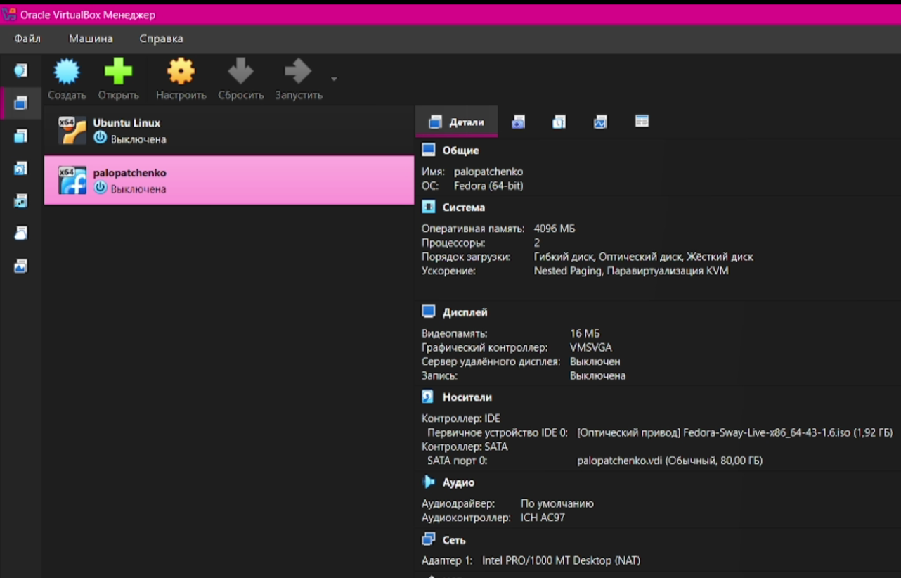
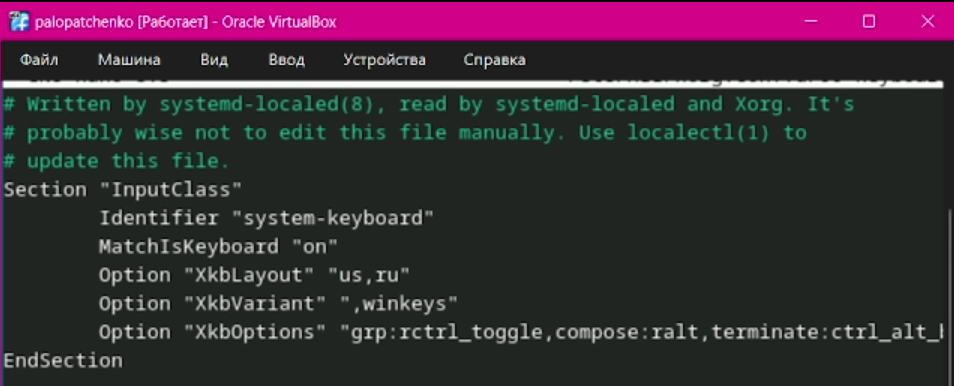
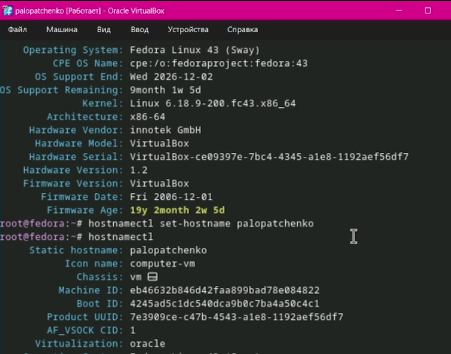
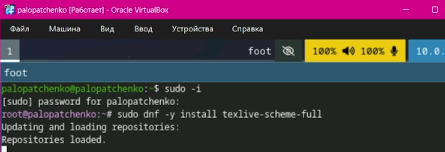
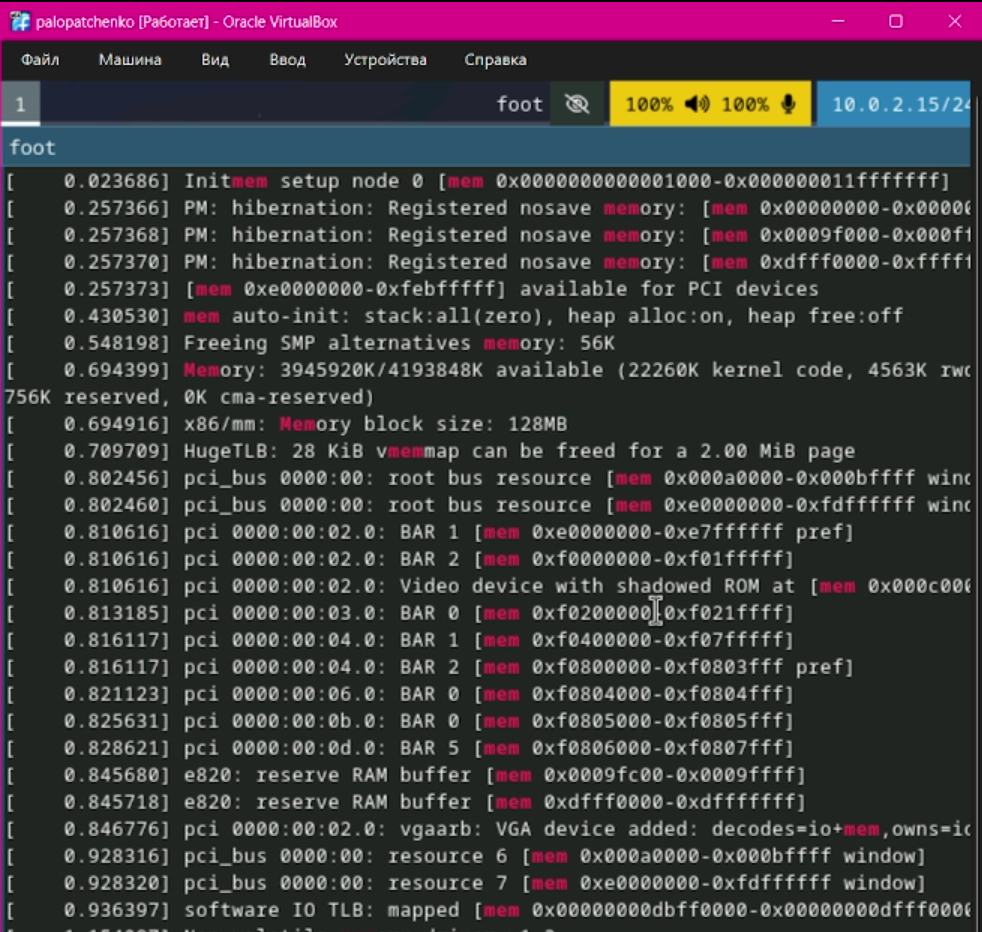

# Цель работы

Цель данной лабораторной работы --- приобретение практических навыков установки операционной системы на виртуальную машину, настройки минимально необходимых для дальнейшей работы сервисов.

# Задание

Освоить базовые команды терминала Linux и получить системную информацию.

# Выполнение лабораторной работы

Создал новую виртуальную машину в графическом интерфейсе и указал имя виртуальной машины, ссответствующее моему логину в дисплейном классе (см. [рис.1](#fig-001)).

{#fig-001 width=70%}

Указал размер основной памяти виртуальной машины --- 4096 ГБ (см. [рис.2](#fig-002)).

{#fig-002 width=70%}

Задал конфигурацию жёского диска --- загрузочный, VDI (см. [рис.3](#fig-003)).

{#fig-003 width=70%}

Задал размер диска --- 80 ГБ (см. [рис.4](#fig-004)).

{#fig-004 width=70%}

Включил общий буфер обмена и перетаскивание объектов между хостом и гостевой ОС (см. [рис.5](#fig-005)).

{#fig-005 width=70%}

Добавил новый привоод оптических дисков и выбрал образ (см. [рис.6](#fig-006)).

{#fig-006 width=70%}

В качестве графического контроллера поставил VMSVGA и включил ускорение 3D (см. [рис.7](#fig-007)).

{#fig-007 width=70%}

Включил поддержку UEFI (см. [рис.8](#fig-008)).

{#fig-008 width=70%}

Установил систему на диск (см. [рис.9](#fig-009)).

{#fig-009 width=70%}

Переключился на роль супер-пользователя и установил средства разработки (см. [рис.10](#fig-010)).

{#fig-010 width=70%}

Обновил все пакеты (см. [рис.11](#fig-011)).

{#fig-011 width=70%}

Установил программу для удобства работы в консоли (см. [рис.12](#fig-012)).

{#fig-012 width=70%}

Установил другой вариант консоли (см. [рис.13](#fig-0013)).

{#fig-013 width=70%}

Установил автоматическое обновление и запустил таймер (см. [рис.14](#fig-0014)).

{#fig-014 width=70%}

Отключил систему безопасности SELinux (см. [рис.15](#fig-0015)).

{#fig-015 width=70%}

Запустил терминальный мультиплексор tmux и создал конфигурационный файл `~/.config/sway/config.d/95-system-keyboard-config.conf` (см. [рис.16](#fig-0016)).

{#fig-016 width=70%}

Отредактировал конфигурационный файл `~/.config/sway/config.d/95-system-keyboard-config.conf` (см. [рис.17](#fig-0017)).

{#fig-017 width=70%}

Переключился на роль супер-пользователя и открыл конфигурационный файл (см. [рис.18](#fig-0018)).

{#fig-018 width=70%}

Отредактировал конфигурационный файл (см. [рис.19](#fig-0019)).

{#fig-019 width=70%}

Установил имя хоста (см. [рис.20](#fig-020)).

{#fig-020 width=70%}

Запустил терминательный мультиплексор tmux, переключился на роль супер-пользователя и установил средство `pandoc` для работты с языком разметки Markdown (см. [рис.21](#fig-021)).

{#fig-021 width=70%}

Продолжил установку `pandoc` (см. [рис.22](#fig-022)).

{#fig-022 width=70%}

Установил дистрибутив TeXlive (см. [рис.23](#fig-023)).

{#fig-023 width=70%}

Внутри виртуальной машины добавил своего пользователя в группу vboxsf, в хостовой системе подключил разделяемую папку и перезагрузил виртуальную машину (см. [рис.31](#fig-031)).

{#fig-031 width=70%}

# Домашнее задание

Получил версию ядра Linux (см. [рис.24](#fig-024)).

{#fig-024 width=70%}

Получил частоту процессора (см. [рис.25](#fig-025)).

{#fig-025 width=70%}

Получил модель процессора (см. [рис.26](#fig-026)).

{#fig-026 width=70%}

Получил объём доступной оперативной памяти (см. [рис.27](#fig-027)).

{#fig-027 width=70%}

Получил тип обнаруженного гипервизора (см. [рис.28](#fig-028)).

{#fig-028 width=70%}

Получил тип файловой системы корневого раздела (см. [рис.29](#fig-029)).

{#fig-029 width=70%}

Получил последовательность монтирования файловых систем (см. [рис.30](#fig-030)).

{#fig-030 width=70%}

# Контрольные вопросы

1. Учётная запись пользователя Linux включает:

- логин и UID;
- основную группу (GID) и дополнительные группы;
- домашний каталог;
- командную оболочку;
- пароль и параметры его политики;
- дополнительные поля (описание, комментарий, имя и т.д.)

2. Указываю команды из терминала и привожу примеры:
- получение справки по команде: `--help` (пример: `ls --help`);
- перемещение по файловой системе: `pwd` (пример: `pwd`); `cd` (пример: `cd /etc`); `cd ..` (пример: `cd ..`); `cd ~` (пример: `cd ~`);
- просмотр содержимого каталога: `ls` (пример: `ls`); `ls -la` (пример: `ls -la /var/log`);
- определение объёма каталога: `du -sh` (пример: `du -sh`);
- для создания каталогов: `mkdir` (пример: `mkdir testdir`);
- для создания файлов: `touch` (пример: `touch testfile.txt`)
- для удаления каталогов: `rmdir` (пример: `rmdir testdir`); `rm -r` (пример: `rm -r testdir`);
- для удаления файлов: `rm`  (пример: `rm testfile.txt`);
- для задания определённых прав на файл/каталог: `chmod` (пример: `chmod 644 testfile.txt`); `chown` (пример: `sudo chown user:group testfile.txt`);
- для просмотра истории команд: history (пример: history);

3. **Файловая система** --- это способ организации и хранения данных на носителе.
Примеры:
- **ext4** --- популярная Linux FS, стабильная, журналируемая;
- **xfs** --- производительная для больших файлов и нагрузок, журналируемая;
- **btrfs** --- поддержка снапшотов, сжатия, подтомов;
- **vfat (FAT32)** --- простая, совместима со многими ОС;
- **ntfs** --- стандарт Windows, в Linux поддерживается через драйвер.

4. Варианты просмотра подмонтированных в ОС систем:
- `mount`;
- `findmnt`;
- `df -T`;
- `cat /proc/mounts`.

5. Удаление зависшего процесса:
1. Найти процесс:
- `ps aux | grep name`
- `top/htop`

2. Завершить процесс:

- `kill PID`

# Выводы

В ходе работы были освоены базовые приёмы работы в терминале Linux и оформления результатов в Markdown. С помощью dmesg и фильтрации grep получены ключевые сведения о системе. Полученные результаты зафиксированы в отчёте и подтверждены скриншотами и скринкастами.
