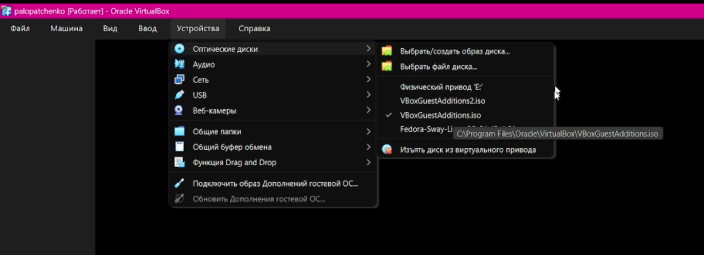
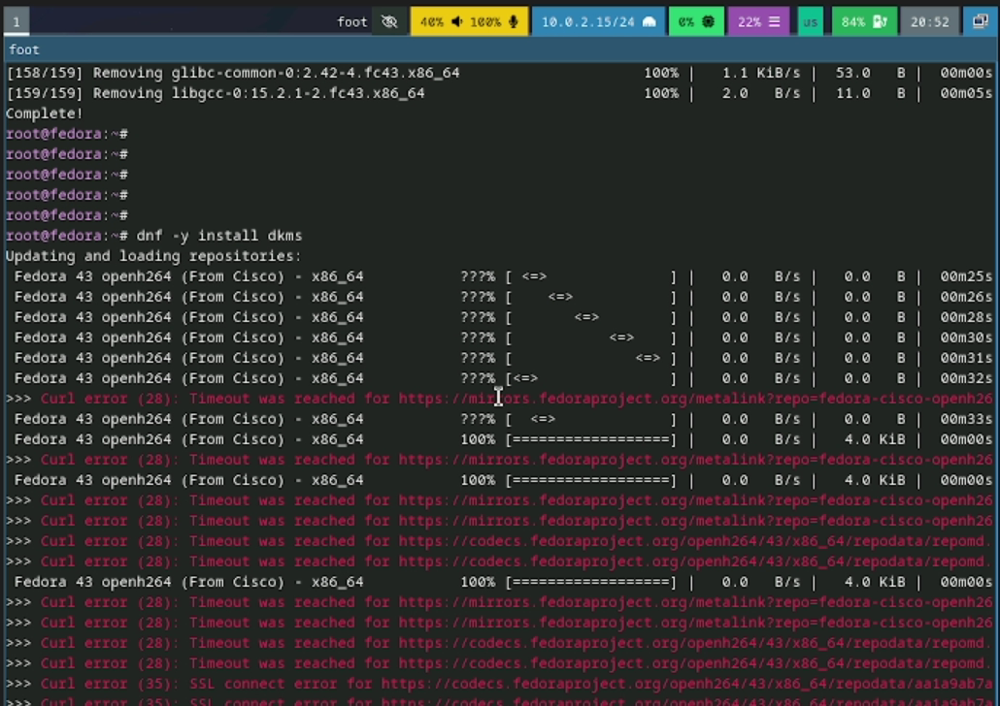
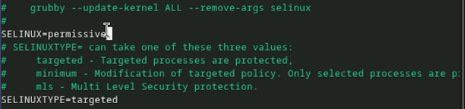
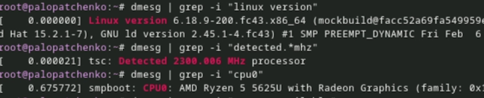
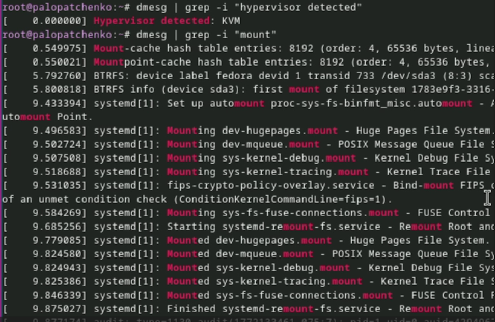

---
## Author
author:
  name: Лопатченко Полина Андреевна
  degrees: DSc
  orcid: 0000-0002-0877-7063
  email: 1032253529@rudn.ru
  affiliation:
    - name: Российский университет дружбы народов
      country: Российская Федерация
      postal-code: 117198
      city: Москва
      address: ул. Миклухо-Маклая, д. 6

## Title
title: "Лабораторная работа №1"
subtitle: "Лабораторная работа установка ОС Linux"
license: "CC BY"
---

# Цель работы
Целью данной работы является приобретение практических навыков установки операционной системыц на виртуальную машину , настройки минимально необходимых
для дальнейшей работы сервисов.

# Задание

Освоить базовые команды терминала Linux и получить системную информацию.

# Выполнение лабораторной работы

Создала новую виртуальную машину в графическом интерфейсе и указал имя виртуальной машины, соответствующее моему логину в дисплейном классе 
Указала размер основной памяти виртуальной машины --- 4096 ГБ
Задала конфигурацию жёского диска --- загрузочный, VDI
Задала размер диска --- 80 ГБ (см. [рис.1](#fig-001)).

{#fig-001 width=70%}

Добавила новый привоод оптических дисков и выбрал образ (см. [рис.2](#fig-002)).

{#fig-002 width=70%}

Обновила все пакеты и установила программу для удобства работы в консоли(см. [рис.3](#fig-003)).

{#fig-3 width=70%}

Отключила систему безопасности SELinux (см. [рис.5](#fig-005)).

{#fig-005 width=70%}

Запустила терминальный мультиплексор tmux и создал конфигурационный файл `~/.config/sway/config.d/95-system-keyboard-config.conf` 

Отредактировала конфигурационный файл `~/.config/sway/config.d/95-system-keyboard-config.conf` (см. [рис.4](#fig-004)).

{#fig-004 width=70%}

Установила имя хоста, добавила своего пользователя в группу vboxsf (см. [рис.6](#fig-006)).

{#fig-006 width=70%}

Запустила терминательный мультиплексор tmux, переключился на роль супер-пользователя и установил средство `pandoc` для работты с языком разметки Markdown (см. [рис.21](#fig-021)).

{#fig-007 width=70%}

Установила дистрибутив TeXlive (см. [рис.8](#fig-008)).

{#fig-008 width=70%}

# Домашнее задание

Получила версию ядра Linux
Получила частоту процессора
Получила модель процессора (см. [рис.9](#fig-009)).

{#fig-009 width=70%}

Получила объём доступной оперативной памяти (см. [рис.10](#fig-010)).

{#fig-010 width=70%}

Получила тип обнаруженного гипервизора
Получила последовательность монтирования файловых систем (см. [рис.11](#fig-011)).

{#fig-011 width=70%}

# Контрольные вопросы

1. Учётная запись пользователя Linux включает:

- логин и UID;
- основную группу (GID) и дополнительные группы;
- домашний каталог;
- командную оболочку;
- пароль и параметры его политики;
- дополнительные поля (описание, комментарий, имя и т.д.)

2. Указываю команды из терминала и привожу примеры:
- получение справки по команде: `--help` (пример: `ls --help`);
- перемещение по файловой системе: `pwd` (пример: `pwd`); `cd` (пример: `cd /etc`); `cd ..` (пример: `cd ..`); `cd ~` (пример: `cd ~`);
- просмотр содержимого каталога: `ls` (пример: `ls`); `ls -la` (пример: `ls -la /var/log`);
- определение объёма каталога: `du -sh` (пример: `du -sh`);
- для создания каталогов: `mkdir` (пример: `mkdir testdir`);
- для создания файлов: `touch` (пример: `touch testfile.txt`)
- для удаления каталогов: `rmdir` (пример: `rmdir testdir`); `rm -r` (пример: `rm -r testdir`);
- для удаления файлов: `rm`  (пример: `rm testfile.txt`);
- для задания определённых прав на файл/каталог: `chmod` (пример: `chmod 644 testfile.txt`); `chown` (пример: `sudo chown user:group testfile.txt`);
- для просмотра истории команд: history (пример: history);

3. **Файловая система** --- это способ организации и хранения данных на носителе.
Примеры:
- **ext4** --- популярная Linux FS, стабильная, журналируемая;
- **xfs** --- производительная для больших файлов и нагрузок, журналируемая;
- **btrfs** --- поддержка снапшотов, сжатия, подтомов;
- **vfat (FAT32)** --- простая, совместима со многими ОС;
- **ntfs** --- стандарт Windows, в Linux поддерживается через драйвер.

4. Варианты просмотра подмонтированных в ОС систем:
- `mount`;
- `findmnt`;
- `df -T`;
- `cat /proc/mounts`.

5. Удаление зависшего процесса:
1. Найти процесс:
- `ps aux | grep name`
- `top/htop`

2. Завершить процесс:

- `kill PID`

# Выводы

В ходе работы были освоены базовые приёмы работы в терминале Linux и оформления результатов в Markdown. С помощью dmesg и фильтрации grep получены ключевые сведения о системе. Полученные результаты зафиксированы в отчёте и подтверждены скриншотами и скринкастами.

