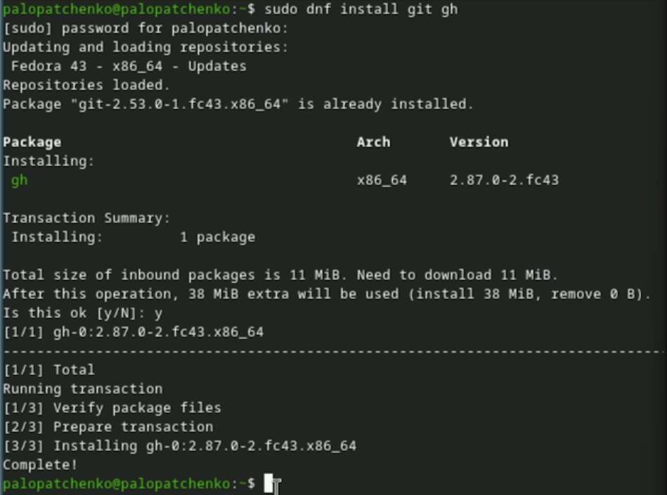
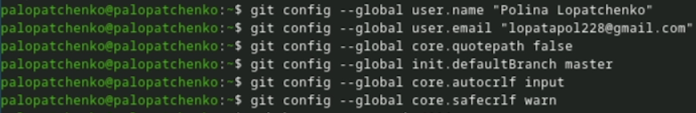
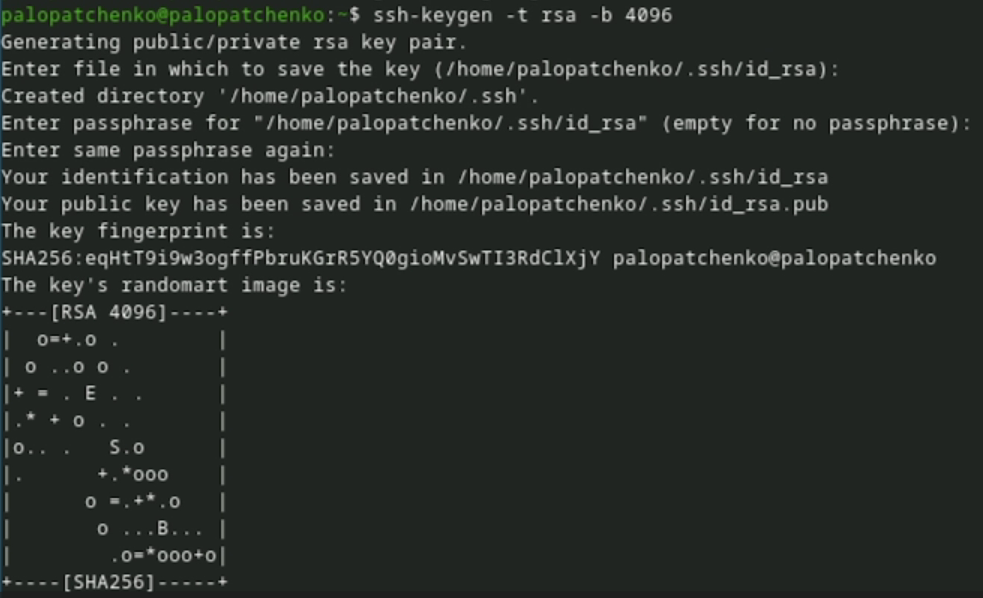
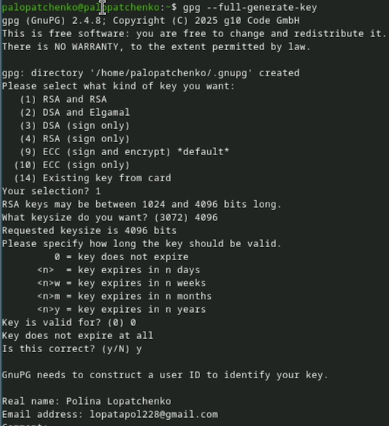
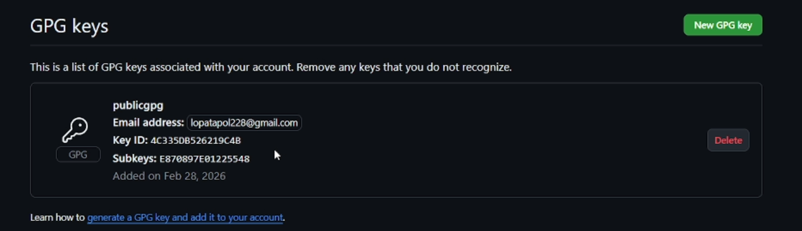
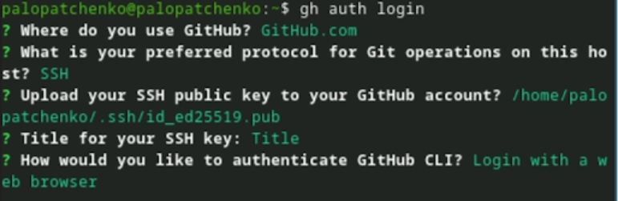
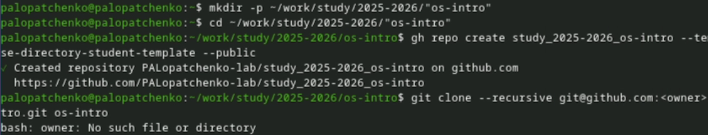
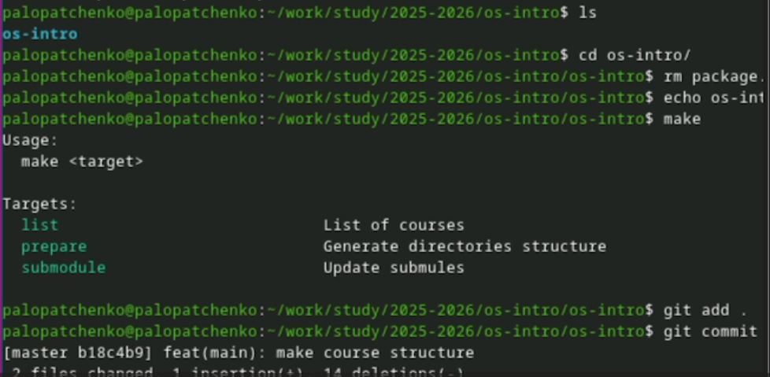

---
## Author
author:
  name: Лопатченко Полина Андреевна
  degrees: DSc
  orcid: 0000-0002-0877-7063
  email: 1032253529@rudn.ru
  affiliation:
    - name: Российский университет дружбы народов
      country: Российская Федерация
      postal-code: 117198
      city: Москва
      address: ул. Миклухо-Маклая, д. 6
## Title
title: Лабораторная работа №2
subtitle: Первоначальная настройка git.
license: CC BY
date: 04.03.2026
date-format: "YYYY-MM-DD" # Example: 2025-09-06
---

# Информация

## Докладчик

:::::::::::::: {.columns align=center}
::: {.column width="70%"}

  * Лопатченко Полина Андреевна
  * студент 1-ого курса
  * НКАбд-04-25
  * Российский университет дружбы народов им. П. Лумумбы
  * [1032253529@rudn.ru](1032253529@rudn.ru)
  * <https://PALopatchenko-lab.github.io/ru/>

:::
::: {.column width="30%"}

:::
::::::::::::::

# Вводная часть

## Цель и задачи
**Цель:** Изучить идеологию и применение средств контроля версий.

**Задачи:**

- Создать базовую конфигурацию для работы с git.
- Создать ключ SSH.
- Создать ключ PGP.
- Настроить подписи git.
- Зарегистрироваться на GitHub.
- Создать локальный каталог для выполнения заданий по предмету.

# Ход работы

## 1) Установка git и gh

Установила git и GitHub CLI gh.

{#fig-001 width=80%}

## 2) Базовая настройка git

Задала имя и email, настроила начальную ветку и параметры CRLF.

{#fig-002 width=80%}

## 3) SSH-ключ для доступа к репозиториям

Создала SSH-ключ.

{#fig-003 width=60%}

## 4) GPG-ключ и подпись коммитов

Создала GPG-ключ и подготовила его для использования в GitHub.

{#fig-005 width=30%}

## 5) Добавление GPG-ключа в GitHub

Ключ добавлен в настройки GitHub.

{#fig-009 width=80%}

## 6) Автоподпись коммитов

Настроила git на автоматическую подпись коммитов.

{#fig-010 width=80%}

## 7) Автоподпись gh

Выполнила вход в GitHub через `gh auth login`.

{#fig-011 width=80%}

## 8) Репозиторий курса и структура каталога

Создала репозиторий по шаблону и подготовила структуру, затем отправила изменения на сервер.

{#fig-012 width=40%}

{#fig-013 width=40%}

# Итоги

## Выводы
- Выполнена базовая конфигурация `git` для работы.
- Сгенерированы и настроены ключи SSH и GPG.
- Настроены GitHub и gh, включена автоподпись коммитов.
- Создан репозиторий курса по шаблону и подготовлена структура каталога.
