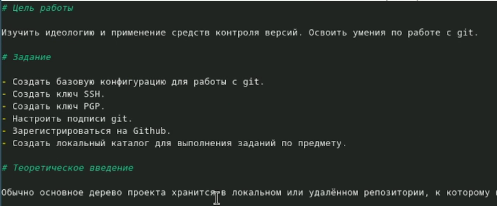

---
## Author
author:
  name: Лопатченко Полина Андреевна
  degrees: студент
  orcid: 0000-0002-0877-7063
  email: 1032253529@rudn.ru
  affiliation:
    - name: Российский университет дружбы народов
      country: Российская Федерация
      postal-code: 117198
      city: Москва
      address: ул. Миклухо-Маклая, д. 6
## Title
title: Лабораторная работа №3
subtitle: Markdown
license: CC BY
date: 2026-03-06
date-format: "YYYY-MM-DD" # Example: 2025-09-06
---

# Информация

## Докладчик

:::::::::::::: {.columns align=center}
::: {.column width="70%"}

  * Лопатченко Полина Андреевна
  * Студент
  * НКАбд-04-25
  * Российский университет дружбы народов им. П. Лумумбы
  * [1032253529@rudn.ru](mailto:1032253529@rudn.ru)
  * <https://PALopatchenko-lab.github.io/ru/>

:::
::: {.column width="30%"}


:::
::::::::::::::

# Вводная часть

## Актуальность

- Важно донести результаты своих исследований до окружающих
- Научная презентация --- рабочий инструмент исследователя
- Необходимо создавать презентацию быстро
- Желательна минимизация усилий для создания презентации

## Объект и предмет исследования

- Презентация как текст
- Программное обеспечение для создания презентаций
- Входные и выходные форматы презентаций

## Цель и задачи
**Цель:** научиться оформлять отчёты с помощью языка разметки Markdown.

**Задачи:**
- сделать отчёт по предыдущей лабораторной работе в формате Markdown;
- подготовить отчёт в трёх форматах: `md`, `pdf`, `docx`.

# Коротко о Markdown

## Что такое Markdown

- лёгкий язык разметки для оформления текста;
- быстро пишется в любом редакторе;
- удобно хранить Git и конвертировать в другие форматы.

## Базовый синтаксис

- заголовки: `#`, `##`, `###`
- выделение: `**bold**`, `*italic*`, `***оба***`
- списки:
      - `- пункт`
      - `1. пункт`
- ссылки: `[текст](url)`
- цитаты: `> цитата`
- код: `` `inline` `` и блоки ``` ```

## Формулы и ссылки на формулы
- внутритекстовая формула: `$\sin^2 x + \cos^2 x = 1$`
- выключная формула:
```
$$
\sin^2 x + \cos^2 x = 1
$$ {#eq:eq:sin2+cos2}
```

* ссылка в тексте: `Смотри формулу ([-@eq:eq:sin2+cos2])`

# Конвертация отчёта

## Pandoc и фильтры

Для преобразования Markdown в другие форматы используется **Pandoc**.

* `pandoc` - конвертер;
* `pandoc-crossref` - перекрёстные ссылки (рисунки, таблицы, формулы);
* `pandoc-citeproc` - обработка цитирований.

## Примеры команд

В PDF:

```
pandoc README.md -o README.pdf
```

B DOCX:

```
pandoc README.md -o README.docx
```

# Выполнение лабораторной работы

## Структура отчёта

Оформила титульные данные и основную информацию отчёта (см. [рис.1](#fig-001)).

{#fig-001 width=85%}

## Цель, задание, теория

Добавила цель, задание и теоретическое введение (см. [рис.2](#fig-002)).

{#fig-002 width=85%}

## Описание выполнения

Описала процесс выполнения лабораторной работы (см. [рис.3](#fig-003)).

{#fig-003 width=85%}

## Контрольные вопросы и выводы

Ответила на контрольные вопросы (см. [рис.5](#fig-005)) и сформулировал выводы.

{#fig-005 width=80%}

# Итоги

## Выводы

В ходе лабораторной работы я освоил оформление отчётов в Markdown и научился преобразовывать документ в форматы `pdf` и `docx` с помощью Pandoc.


:::
