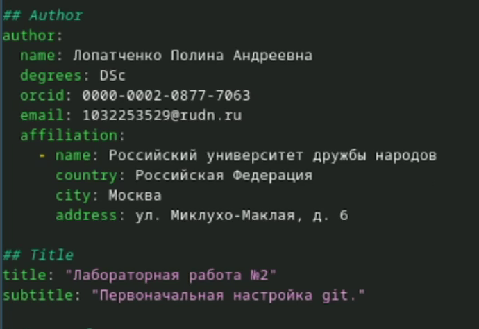
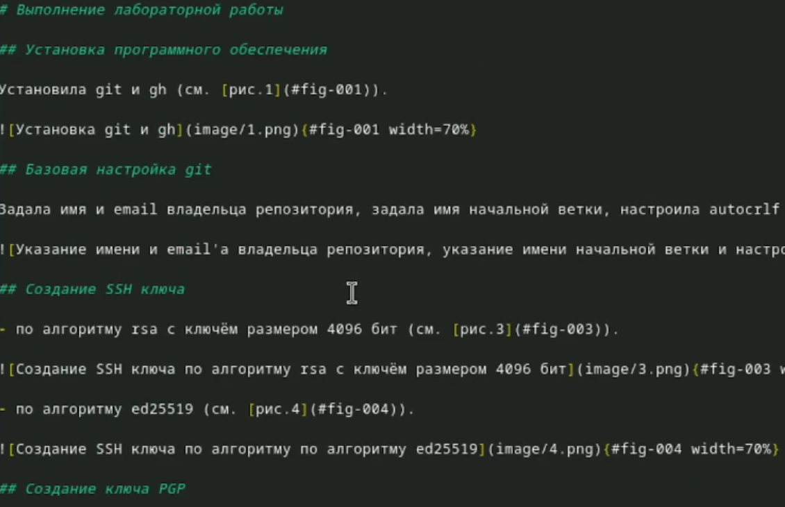
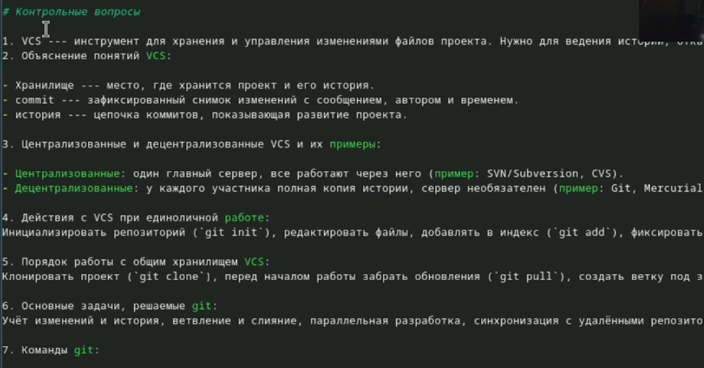
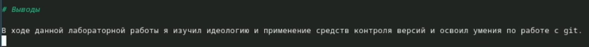

---
## Author
author:
  name: Лопатченко Полина Андреевна
  degrees: студент
  orcid: 0000-0002-0877-7063
  email: 1032253529@rudn.ru
  affiliation:
    - name: Российский университет дружбы народов
      country: Российская Федерация
      postal-code: 117198
      city: Москва
      address: ул. Миклухо-Маклая, д. 6

## Title
title: "Лабораторная работа №3"
subtitle: "Markdown"
license: ""
---

# Цель работы

Научиться оформлять отчеты с помощью легковесного языка разметки Markdown.

# Задание

- Сделать отчёт по предыдущей лабораторной работе в формате Markdown.
- Предоставить отчёты в трёх форматах: `pdf`, `docx` и `md`.

# Теоретическое введение

## Базовые сведения о Markdown

Чтобы создать заголовок, используйте знак (`#`), например:

```
# This is heading 1
## This is heading 2
### This is heading 3
#### This is heading 4
```

Чтобы задать для текста полужирное начертание, заключите его в двойные звездочки:

```
This text is **bold**.
```

Чтобы задать для текста курсивное начертание, заключите его в одинарные звездочки:

```
This text is *italic*.
```

Чтобы задать для текста полужирное и курсивное начертание, заключите его в тройные
звездочки:

```
This is text is both ***bold and italic***.
```

Блоки цитирования создаются с помощью символа >:

```
> The drought had lasted now for ten million years, and the reign of
the terrible lizards had long since ended. Here on the Equator, in
the continent which would one day be known as Africa, the battle
for existence had reached a new climax of ferocity, and the victor
was not yet in sight. In this barren and desiccated land, only the
small or the swift or the fierce could flourish, or even hope to
survive.
```

Неупорядоченный (маркированный) список можно отформатировать с помощью звездочек или тире:

```
- List item 1
- List item 2
- List item 3
```

Чтобы вложить один список в другой, добавьте отступ для элементов дочернего списка:

```
- List item 1
      - List item A
      - List item B
- List item 2
```

Упорядоченный список можно отформатировать с помощью соответствующих цифр:

```
1. First instruction
1. Second instruction
1. Third instruction
```

Чтобы вложить один список в другой, добавьте отступ для элементов дочернего списка:

```
1. First instruction
      1. Sub-instruction
      1. Sub-instruction
1. Second instruction
```

Синтаксис Markdown для встроенной ссылки состоит из части `[link text]`, представляющей текст гиперссылки, и части `(file-name.md)` – URL-адреса или имени файла,
на который дается ссылка:

```
[link text](file-name.md)
```

Markdown поддерживает как встраивание фрагментов кода в предложение, так и их
размещение между предложениями в виде отдельных огражденных блоков. Огражденные
блоки кода — это простой способ выделить синтаксис для фрагментов кода. Общий
формат огражденных блоков кода:

``` language
your code goes in here
```

Верхние и нижние индексы:
H~2~0
записывается как

```
H~2~0
```

2^10^
Внутритекстовые формулы делаются аналогично формулам LaTeX. Например, формула $\sin^2 (x) + \cos^2 (x) = 1$ запишется как

```
$\sin^2 (x) + \cos^2 (x) = 1$
```

Выключные формулы:
$$
\sin^2 (x) + \cos^2 (x) = 1
$$
{#eq:eq:sin2+cos2} со ссылкой в тексте «Смотри формулу ([-@eq:eq:sin2+cos2]).» записывается как

```
$$
\sin^2 (x) + \cos^2 (x) = 1
$$ {#eq:eq:sin2+cos2}

Смотри формулу ([-@eq:eq:sin2+cos2]).
```

## Обработка файлов в формате Markdown
Для обработки файлов в формате Markdown будем использовать Pandoc https://pandoc.org/. Конкретно, нам понадобится программа `pandoc`, `pandoc-citeproc` https://github.com/jgm/pandoc/releases, `pandoc-crossref` https://github.com/lierdakil/pandoc-crossref/releases.
Преобразовать файл `README.md` можно следующим образом:

```
pandoc README.md -o README.pdf
```

или так

```
pandoc README.md -o README.docx
```

Можно использовать следующий `Makefile`

```
FILES = $(patsubst %.md, %.docx, $(wildcard *.md))
FILES += $(patsubst %.md, %.pdf, $(wildcard *.md))

LATEX_FORMAT =

FILTER = --filter pandoc-crossref

%.docx: %.md
      -pandoc "$<" $(FILTER) -o "$@"

%.pdf: %.md
      -pandoc "$<" $(LATEX_FORMAT) $(FILTER) -o "$@"

all: $(FILES)
      @echo $(FILES)

clean:
      -rm $(FILES) *~
```

# Выполнение лабораторной работы

Указала основную информацию о лабораторной работе (см. [рис.1](#fig-001)).

{#fig-001 width=70%}

Указала цель, задание и теоретическое введение лабораторной работы (см. [рис.2](#fig-002)).

{#fig-002 width=70%}

Описала процесс выполнения лабораторной работы (см. [рис.3](#fig-003)).

{#fig-003 width=70%}

Ответила на контрольные вопросы (см. [рис.5](#fig-005)).

{#fig-005 width=70%}

Описал выводы к лабораторной работе (см. [рис.6](#fig-006)).

{#fig-006 width=70%}


# Выводы

В ходе данной лабораторной работы я научился оформалять отчёты с помощью легковесного языка разметки Markdown.
