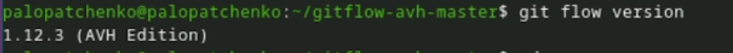
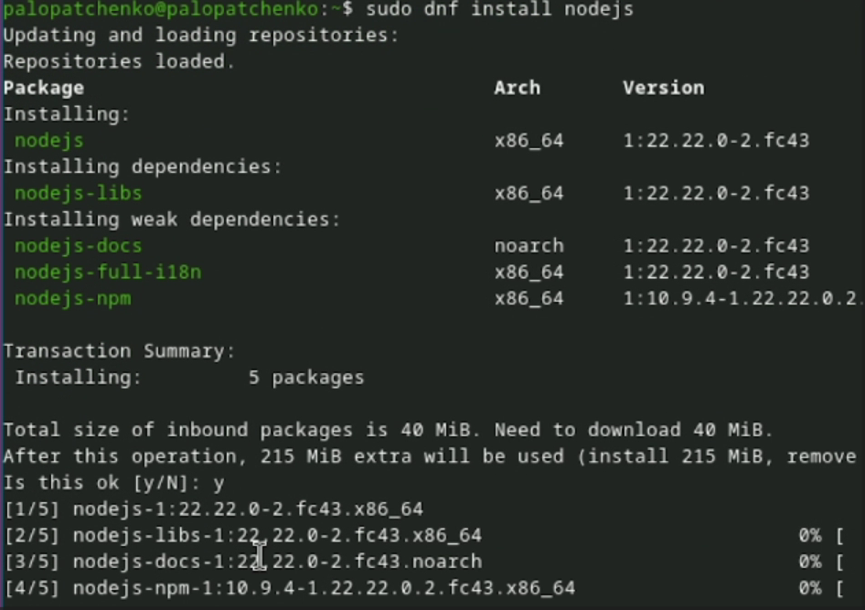
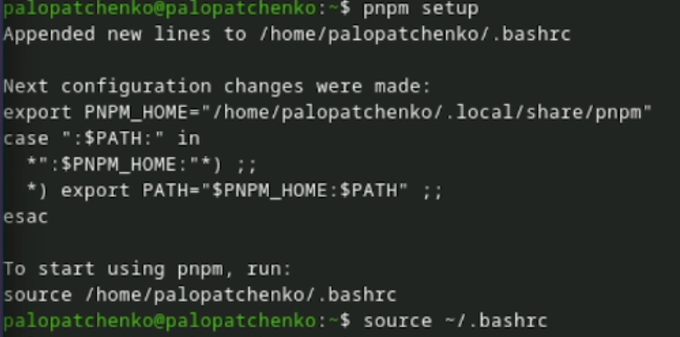
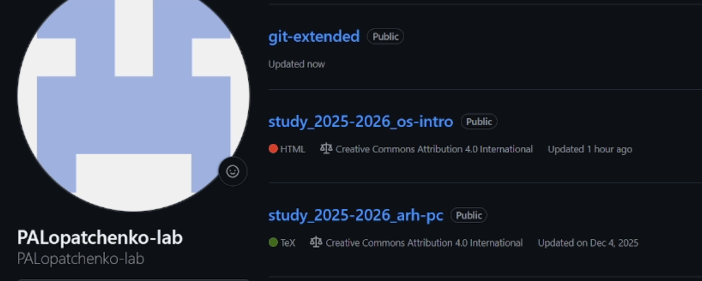
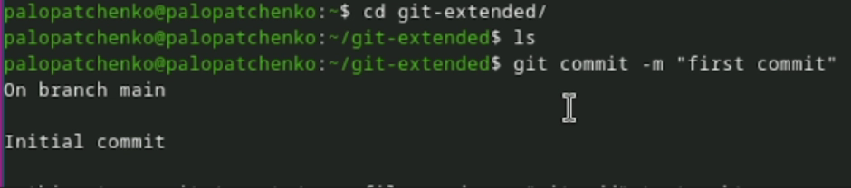
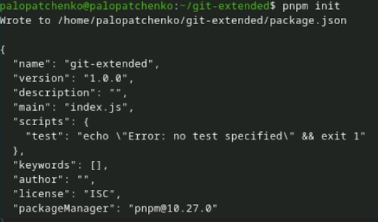
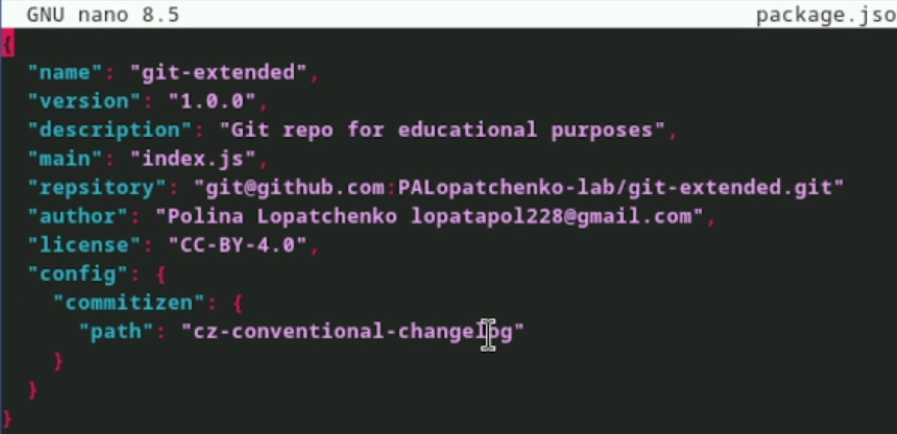
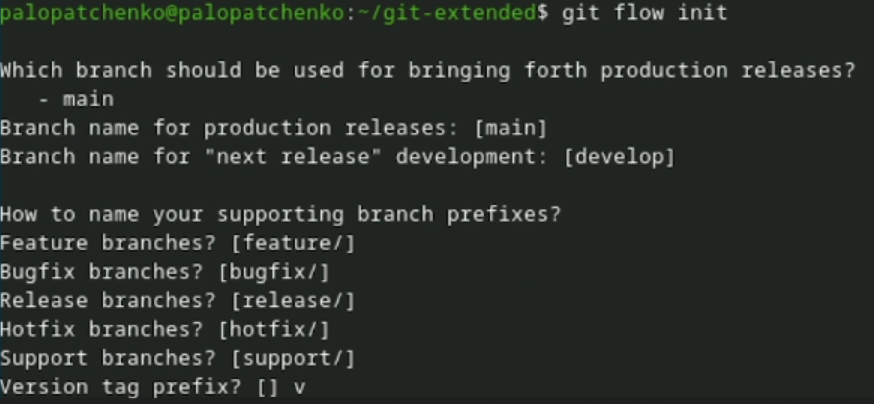
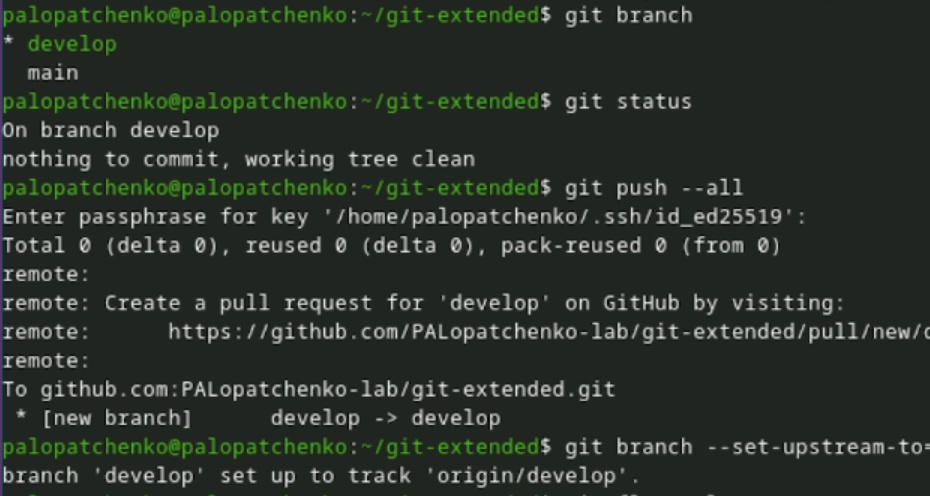
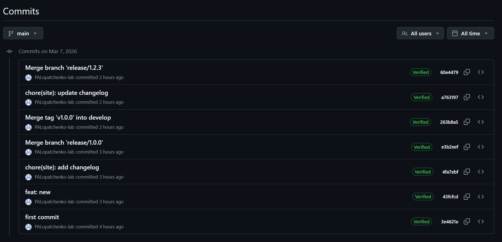

---
## Author
author:
  name: Дмитрий Сергеевич Кулябов
  degrees: DSc
  orcid: 0000-0002-0877-7063
  email: kulyabov-ds@rudn.ru
  affiliation:
    - name: Российский университет дружбы народов
      country: Российская Федерация
      postal-code: 117198
      city: Москва
      address: ул. Миклухо-Маклая, д. 6

## Title
title: "Шаблон отчёта по лабораторной работе"
subtitle: "Простейший вариант"
license: "CC BY"
---

# Цель работы

Здесь приводится формулировка цели лабораторной работы.
Формулировки цели для каждой лабораторной работы приведены в методических указаниях.

Цель данного шаблона --- максимально упростить подготовку отчётов по лабораторным работам.
Модифицируя данный шаблон, студенты смогут без труда подготовить отчёт по лабораторным работам, а также познакомиться с основными возможностями разметки Markdown.

# Задание

Здесь приводится описание задания в соответствии с рекомендациями методического пособия и выданным вариантом.

# Теоретическое введение

## Рабочий процесс Gitflow
- Рабочий процесс *Gitflow Workflow*. Будем описывать его с использованием пакета `git-flow`.

### Общая информация
- Gitflow Workflow опубликована и популяризована Винсентом Дриссеном.
- Gitflow Workflow предполагает выстраивание строгой модели ветвления с учётом выпуска проекта.
- Данная модель отлично подходит для организации рабочего процесса на основе релизов.
- Работа по модели Gitflow включает создание отдельной ветки для исправлений ошибок в рабочей среде.
- Последовательность действий при работе по модели Gitflow:
	- Из ветки `master` создаётся ветка `develop`.
	- Из ветки `develop` создаётся ветка `release`.
	- Из ветки `develop` создаются ветки `feature`.
	- Когда работа над веткой `feature` завершена, она сливается с веткой `develop`.
	- Когда работа над веткой релиза `release` завершена, она сливается в ветки `develop` и `master`.
	- Если в `master` обнаружена проблема, из `master` создаётся ветка `hotfix`.
	- Когда работа над веткой исправления `hotfix` завершена, она сливается в ветки `develop` и `master`.

### Процесс работы с Gitflow
1. Основные ветки (`master`) и ветки разработки (`develop`)

	- Для фиксации истории проекта в рамках этого процесса вместо одной ветки `master` используются две ветки. В ветке `master` хранится официальная история релиза, а ветка `develop` предназначена для объединения всех функций. Кроме того, для удобства рекомендуется присваивать всем коммитам в ветке `master` номер версии.
	- При использовании библиотеки расширений `git-flow` нужно инициализировать структуру в существующем репозитории:
	```
	git flow init
	```
	- Для github параметр `Version tag prefix` следует установить в `v`.
	- После этого проверьте, на какой ветке Вы находитесь:
	```
	git branch
	```

1. Функциональные ветки (feature)

	- Под каждую новую функцию должна быть отведена собственная ветка, которую можно отправлять в центральный репозиторий для создания резервной копии или совместной работы команды. Ветки `feature` создаются не на основе `master`, а на основе `develop`. Когда работа над функцией завершается, соответствующая ветка сливается обратно с веткой `develop`. Функции не следует отправлять напрямую в ветку `master`.
	- Как правило, ветки `feature` создаются на основе последней ветки `develop`.
		1. Создание функциональной ветки
			- Создадим новую функциональную ветку:
			```
			git flow feature start feature_branch
			```
			- Создадим новую функциональную ветку:
			```
			git flow feature start feature_branch
			```
			- Далее работаем как обычно.

		1. Окончание работы с функциональной веткой

			- По завершении работы над функцией следует объединить ветку `feature_branch` с `develop`:
			```
			git flow feature finish feature_branch
			```
		1. Ветки выпуска (release)

			- Когда в ветке `develop` оказывается достаточно функций для выпуска, из ветки `develop` создаётся ветка `release`. Создание этой ветки запускает следующий цикл выпуска, и с этого момента новые функции добавить больше нельзя — допускается лишь отладка, создание документации и решение других задач. Когда подготовка релиза завершается, ветка `release` сливается с `master` и ей присваивается номер версии. После нужно выполнить слияние с веткой `develop`, в которой с момента создания ветки релиза могли возникнуть изменения.
			- Благодаря тому, что для подготовки выпусков используется специальная ветка, одна команда может дорабатывать текущий выпуск, в то время как другая команда продолжает работу над функциями для следующего.
			- Создать новую ветку release можно с помощью следующей команды:
			```
			git flow release start 1.0.0
			```
			- Для завершения работы на ветке release используются следующие команды:
			```
			git flow release finish 1.0.0
			```

		1. Ветки исправления (hotfix)

			- Ветки поддержки или ветки `hotfix` используются для быстрого внесения исправлений в рабочие релизы. Они создаются от ветки `master`. Это единственная ветка, которая должна быть создана непосредственно от `master`. Как только исправление завершено, ветку следует объединить с `master` и `develop`. Ветка `master` должна быть помечена обновлённым номером версии.
			- Наличие специальной ветки для исправления ошибок позволяет команде решать проблемы, не прерывая остальную часть рабочего процесса и не ожидая следующего цикла релиза.
			- Ветку `hotfix` можно создать с помощью следующих команд:
			```
			git flow hotfix start hotfix_branch
			```
			По завершении работы ветка `hotfix` объединяется с `master` и `develop`:
			```
			git flow hotfix finish hotfix_branch
			```

## Семантическое версионирование

Семантический подход в версионированию программного обеспечения.

### Краткое описание семантического версионирования

- Семантическое версионирование описывается в манифесте семантического версионирования.

- Кратко его можно описать следующим образом:

	- Версия задаётся в виде кортежа `МАЖОРНАЯ_ВЕРСИЯ.МИНОРНАЯ_ВЕРСИЯ.ПАТЧ`.
	- Номер версии следует увеличивать:
		- МАЖОРНУЮ версию, когда сделаны обратно несовместимые изменения API.
		- МИНОРНУЮ версию, когда вы добавляете новую функциональность, не нарушая обратной совместимости.
		- ПАТЧ-версию, когда вы делаете обратно совместимые исправления.
	- Дополнительные обозначения для предрелизных и билд-метаданных возможны как дополнения к МАЖОРНАЯ.МИНОРНАЯ.ПАТЧ формату.

### Программное обеспечение
- Для реализации семантического версионирования создано несколько программных продуктов.
- При этом лучше всего использовать комплексные продукты, которые используют информацию из коммитов системы версионирования.
- Коммиты должны иметь стандартизованный вид.
- В семантическое версионирование применяется вместе с *общепринятыми коммитами*.

	1. Пакет Conventional Changelog

		- Пакет Conventional Changelog является комплексным решением по управлению коммитами и генерации журнала изменений.
		- Содержит набор утилит, которые можно использовать по-отдельности.

## Общепринятые коммиты

Использование спецификации Conventional Commits.

### Описание
Спецификация Conventional Commits:

- Соглашение о том, как нужно писать сообщения commit'ов.
- Совместимо с SemVer. Даже вернее сказать, сильно связано с семантическим версионированием.
- Регламентирует структуру и основные типы коммитов.

	1. Структура коммита
		```
		<type>(<scope>): <subject>
		<BLANK LINE>
		<body>
		<BLANK LINE>
		<footer>
		Или, по-русски:

		<тип>(<область>): <описание изменения>
		<пустая линия>
		[необязательное тело]
		<пустая линия>
		[необязательный нижний колонтитул]
		```
		- Заголовок является обязательным.
		- Любая строка сообщения о фиксации не может быть длиннее 100 символов.
		- Тема (subject) содержит краткое описание изменения.
			- Используйте повелительное наклонение в настоящем времени: «изменить» ("change" not "changed" nor "changes").
			- Не используйте заглавную первую букву.
			- Не ставьте точку в конце.
		- Тело (body) должно включать мотивацию к изменению и противопоставлять это предыдущему поведению.
			- Как и в теме, используйте повелительное наклонение в настоящем времени.
		- Нижний колонтитул (footer) должен содержать любую информацию о критических изменениях.
			- Следует использовать для указания внешних ссылок, контекста коммита или другой мета информации.
			- Также содержит ссылку на issue (например, на github), который закрывает эта фиксация.
			- Критические изменения должны начинаться со слова `BREAKING CHANGE`: с пробела или двух символов новой строки. Затем для этого используется остальная часть сообщения фиксации.
	1. Типы коммитов
		1. Базовые типы коммитов
			- `fix:` — коммит типа fix исправляет ошибку (bug) в вашем коде (он соответствует PATCH в SemVer).
			- `feat:` — коммит типа feat добавляет новую функцию (feature) в ваш код (он соответствует MINOR в SemVer).
			- `BREAKING CHANGE:` — коммит, который содержит текст `BREAKING CHANGE:` в начале своего не обязательного тела сообщения (body) или в подвале (footer), добавляет изменения, нарушающие обратную совместимость вашего API (он соответствует MAJOR в SemVer). BREAKING CHANGE может быть частью коммита любого типа.
			- `revert:` — если фиксация отменяет предыдущую фиксацию. Начинается с revert:, за которым следует заголовок отменённой фиксации. В теле должно быть написано: Это отменяет фиксацию <hash> (это SHA-хэш отменяемой фиксации).
			- Другое: коммиты с типами, которые отличаются от `fix:` и `feat:`, также разрешены. Например, @commitlint/config-conventional (основанный на The Angular convention) рекомендует: chore:, docs:, style:, refactor:, perf:, test:, и другие.
		1. Соглашения The Angular convention
			- Одно из популярных соглашений о поддержке исходных кодов — конвенция Angular (The Angular convention).
			1. Типы коммитов The Angular convention
				Конвенция Angular (The Angular convention) требует следующие типы коммитов:

			- `build:` — изменения, влияющие на систему сборки или внешние зависимости (примеры областей (scope): gulp, broccoli, npm).
			- `ci:` — изменения в файлах конфигурации и скриптах CI (примеры областей: Travis, Circle, BrowserStack, SauceLabs).
			- `docs:` — изменения только в документации.
			- `feat:` — новая функция.
			- `fix:` — исправление ошибок.
			- `perf:` — изменение кода, улучшающее производительность.
			- `refactor:` — Изменение кода, которое не исправляет ошибку и не добавляет функции (рефакторинг кода).
			- `style:` — изменения, не влияющие на смысл кода (пробелы, форматирование, отсутствие точек с запятой и т. д.).
			- `test:` — добавление недостающих тестов или исправление существующих тестов.
			1. Области действия (scope)
				Областью действия должно быть имя затронутого пакета npm (как его воспринимает человек, читающий журнал изменений, созданный из сообщений фиксации).
				Есть несколько исключений из правила «использовать имя пакета»:

			- `packaging` — используется для изменений, которые изменяют структуру пакета, например, изменения общедоступного пути.
			- `changelog` — используется для обновления примечаний к выпуску в CHANGELOG.md.
			- отсутствует область действия — полезно для изменений стиля, тестирования и рефакторинга, которые выполняются во всех пакетах (например, style: добавить отсутствующие точки с запятой).
		1. Соглашения @commitlint/config-conventional
			Соглашение @commitlint/config-conventional входит в пакет Conventional Changelog. В целом в этом соглашении придерживаются соглашения Angular.

# Выполнение лабораторной работы

## Установка программного обеспечения

### Установка git-flow

Установила git-flow (см. [рис.1](#fig-001)).

{#fig-001 width=70%}

### Установка Node.js

Установила Node.js (см. [рис.2](#fig-002)).

{#fig-002 width=70%}

### Настройка Node.js

Запустила `pnpm setup` и выполнила `source ~/.bashrc` (см. [рис.3](#fig-003)).

{#fig-003 width=70%}

## Практический сценарий использования git

### Создание репозитория git

1. Подключение репозитория к github

- Создала репозиторий на GitHub. Назвала его `git-extended` (см. [рис.4](#fig-004)).

{#fig-004 width=70%}

- Сделала первый коммит и выложила его на github (см. [рис.5](#fig-005)).

{#fig-005 width=70%}

1. Конфигурация общепринятых коммитов (см. [рис.6](#fig-006)).

- Конфигурация пакетов Node.js (см. [рис.6](#fig-006)).

{#fig-006 width=70%}

Заполнила несколько параметров пакета и сконфигурировала формат коммитов (см. [рис.7](#fig-007)).

{#fig-007 width=70%}


1. Конфигурация git-flow

- Инициализировал git-flow (см. [рис.11](#fig-011)).

{#fig-011 width=70%}

- Проверила, что я на ветке `develop`, загрузила весь репозиторий в хранилище, установила внешнюю ветку как вышестоящую для этой ветки и создала релиз с версией 1.0.0 (см. [рис.12](#fig-012)).

{#fig-012 width=70%}

Залила релизную ветку в основную ветку, отправила данные и создала релиз на github (см. [рис.14](#fig-014)).

{#fig-014 width=70%}

### Работа с репозиторием git

1. Создание релиза git-flow

- Создала релиз с версией `1.2.3`, обновила номер версии в `package.json`, создала журнал изменений и добавила журнал изменений в индекс, залила релизную ветку в основную ветку, (см. [рис.16](#fig-016)).

{#fig-016 width=70%}

- Отправила данные на github, создала релиз на github с комментариями из журнала изменений (см. [рис.17](#fig-017)).

{#fig-017 width=70%}

# Выводы

В ходе данной лабораторной работы были получены навыки правильной работы с репозиториями git.
