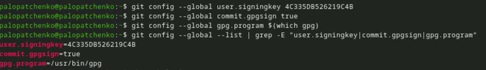

---
## Author
author:
  name: Дмитрий Сергеевич Кулябов
  degrees: DSc
  orcid: 0000-0002-0877-7063
  email: kulyabov-ds@rudn.ru
  affiliation:
    - name: Российский университет дружбы народов
      country: Российская Федерация
      postal-code: 117198
      city: Москва
      address: ул. Миклухо-Маклая, д. 6
## Title
title: Структура научной презентации
subtitle: Простейший вариант
license: CC BY
date: today
date-format: "YYYY-MM-DD" # Example: 2025-09-06
---

# Информация

## Докладчик

:::::::::::::: {.columns align=center}
::: {.column width="70%"}

  * Кулябов Дмитрий Сергеевич
  * д.ф.-м.н., профессор
  * профессор кафедры теории вероятностей и кибербезопасности
  * Российский университет дружбы народов им. П. Лумумбы
  * [kulyabov-ds@rudn.ru](mailto:kulyabov-ds@rudn.ru)
  * <https://yamadharma.github.io/ru/>

:::
::: {.column width="30%"}

:::
::::::::::::::

# Вводная часть

## Актуальность

- Важно донести результаты своих исследований до окружающих
- Научная презентация --- рабочий инструмент исследователя
- Необходимо создавать презентацию быстро
- Желательна минимизация усилий для создания презентации

## Объект и предмет исследования

- Презентация как текст
- Программное обеспечение для создания презентаций
- Входные и выходные форматы презентаций

## Цели и задачи

- Создать шаблон презентации в Markdown
- Описать алгоритм создания выходных форматов презентаций

## Задачи лабораторной работы

1 Выполнить работу для тестового репозитория.

2 Преобразовать рабочий репозиторий в репозиторий с git-flow и conventional commits.

# Процесс выполнения лабораторной работы

## Node.js

{ #fig:001 width=70% height=70% }

## commitizen

{ #fig:002 width=70% height=70% }

## standard-changelog

{ #fig:003 width=70% height=70% }

## package.json

{ #fig:004 width=70% height=70% }

## Использование commitizen

{ #fig:005 width=70% height=70% }

## git-flow

{ #fig:006 width=70% height=70% }

## git-flow

{ #fig:007 width=70% height=70% }

## Отправим данные на github

{ #fig:008 width=70% height=70% }

## Объединение веток

{ #fig:009 width=70% height=70% }

## git-flow

{ #fig:010 width=70% height=70% }

## Подготовка рабочего репозитория

{ #fig:011 width=70% height=70% }

## Подготовка рабочего репозитория

{ #fig:012 width=70% height=70% }

# Выводы по проделанной работе

## Вывод

Мы приобрели практические навыки взаимодействия с дополнительными функциями гитхаб.

