---
## Author
author:
  name: Лопатченко Полина Андреевна
  degrees: студент
  orcid: 0000-0002-0877-7063
  email: 1032253529@rudn.ru
  affiliation:
    - name: Российский университет дружбы народов
      country: Российская Федерация
      postal-code: 117198
      city: Москва
      address: ул. Миклухо-Маклая, д. 6
## Title
title: Лабораторная работа №6
subtitle: Основы интерфейса взаимодействия пользователя с системой Unix на уровне командной строки.
license: CC BY
date: 2026-03-21
date-format: "YYYY-MM-DD" # Example: 2025-09-06
---

# Информация

## Докладчик

:::::::::::::: {.columns align=center}
::: {.column width="70%"}

  * Лопатченко Полина Андреевна
  * студент
  * НКАбд-04-25
  * Российский университет дружбы народов им. П. Лумумбы
  * [1032253529@rudn.ru](mailto:1032253529@rudn.ru)
  * <https://PALopatchenko-lab.github.io/ru/>

:::
::: {.column width="30%"}

:::
::::::::::::::

# Вводная часть

## Актуальность

- Важно донести результаты своих исследований до окружающих
- Научная презентация --- рабочий инструмент исследователя
- Необходимо создавать презентацию быстро
- Желательна минимизация усилий для создания презентации

## Объект и предмет исследования

- Презентация как текст
- Программное обеспечение для создания презентаций
- Входные и выходные форматы презентаций

## Цель работы

Приобретение практических навыков взаимодействия пользователя с системой посредством командной строки.

## Задачи лабораторной работы

1 Определить имя и путь домашнего каталога

2 Изучить команду ls.

3 Выполнить действия с каталогами.

4 Получить дополнительные сведения при помощи справки по командам.

5 Изучить команду history.

# Процесс выполнения лабораторной работы

## Имя и путь к домашнему каталогу 

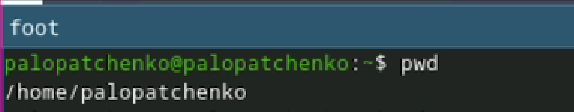{ #fig:001 width=70% height=70% }

## Опции команды ls

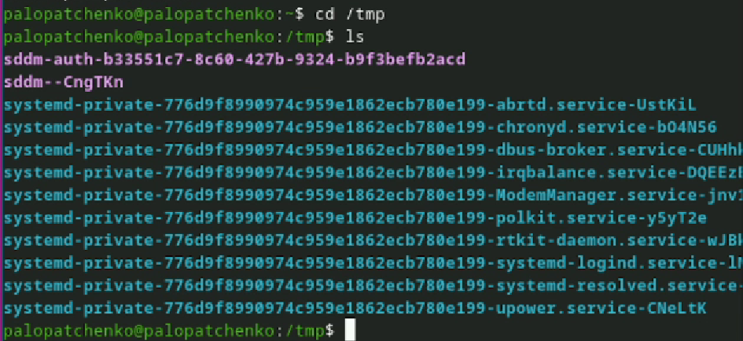{ #fig:002 width=70% height=70% }

## Опции команды ls

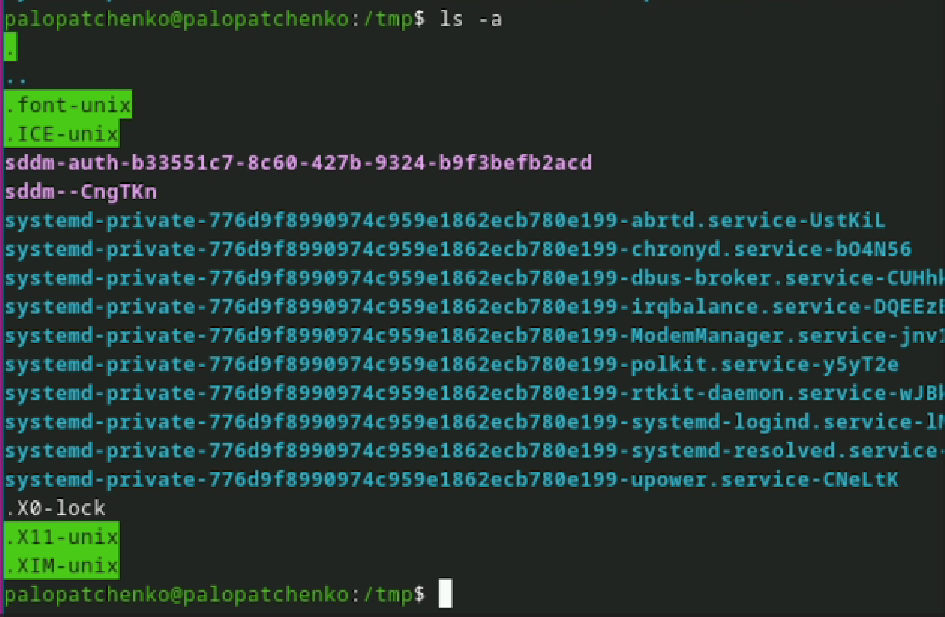{ #fig:003 width=70% height=70% }

## Опции команды ls

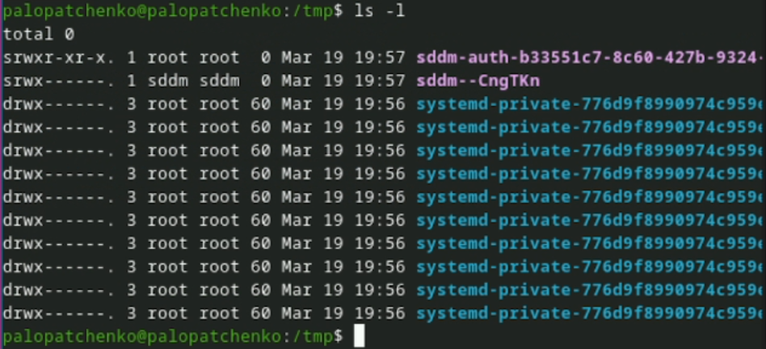{ #fig:004 width=70% height=70% }

## Опции команды ls

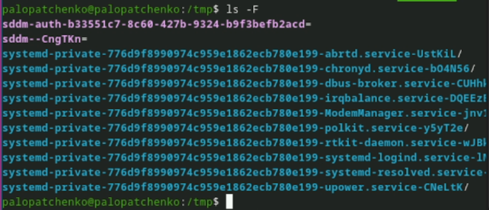{ #fig:005 width=70% height=70% }

## Каталог /var/spool

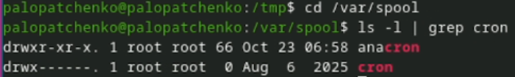{ #fig:006 width=70% height=70% }

## Домашний каталог

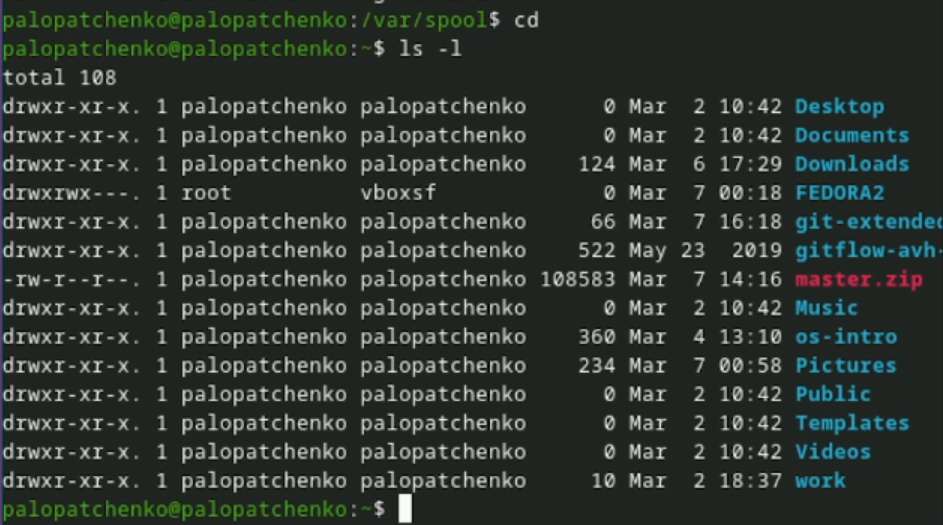{ #fig:007 width=70% height=70% }

## Работа с каталогами

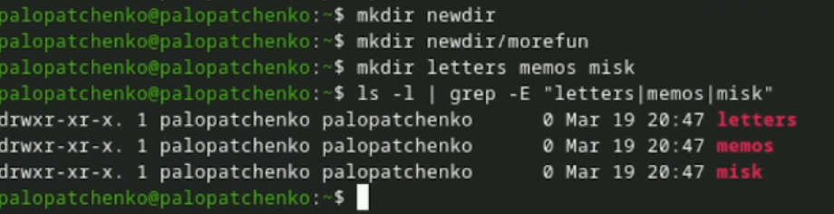{ #fig:008 width=70% height=70% }

## Опции команды ls

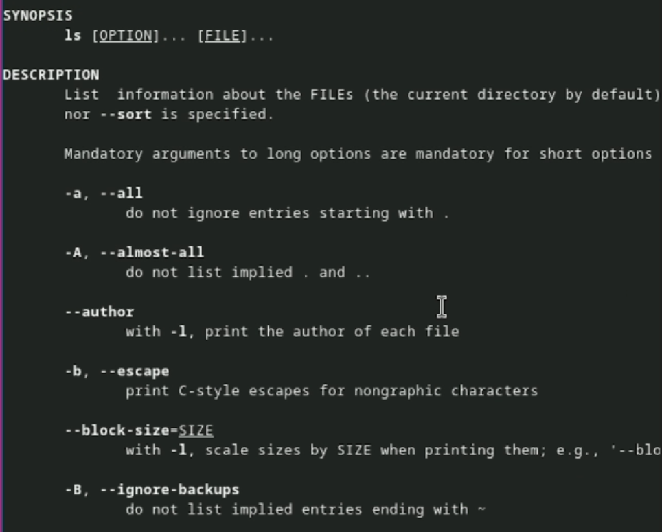{ #fig:009 width=70% height=70% }

## Справка по командам

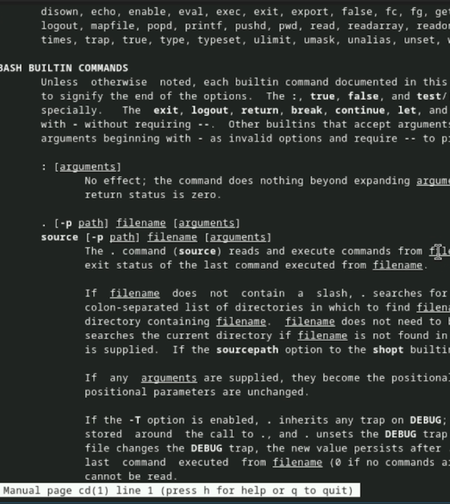{ #fig:010 width=70% height=70% }

## Справка по командам

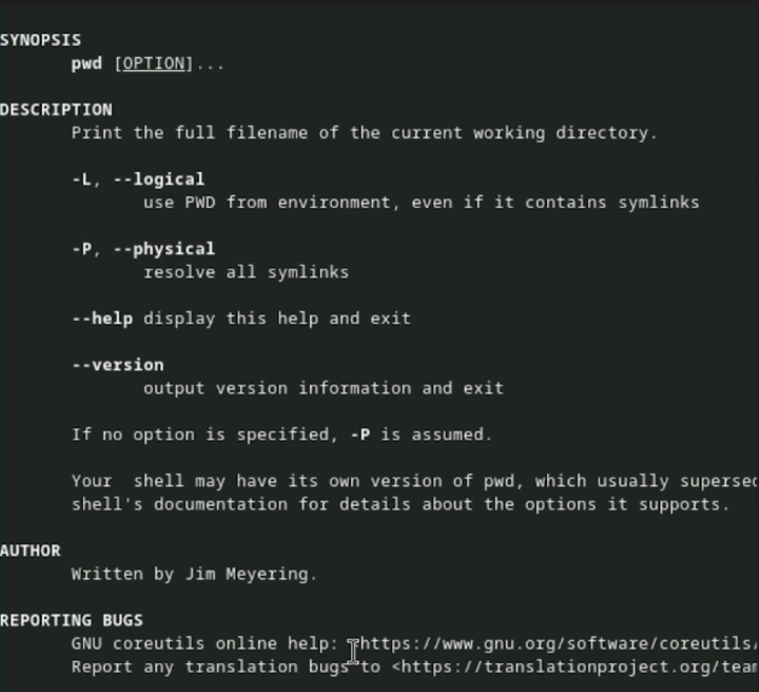{ #fig:011 width=70% height=70% }

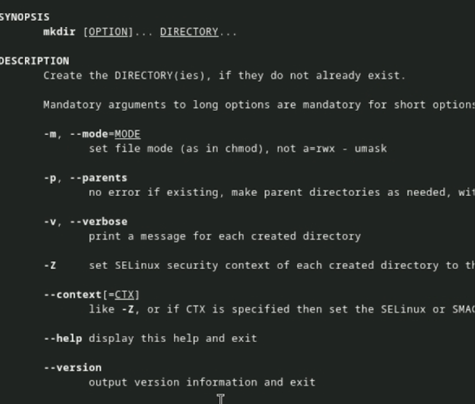{ #fig:012 width=70% }

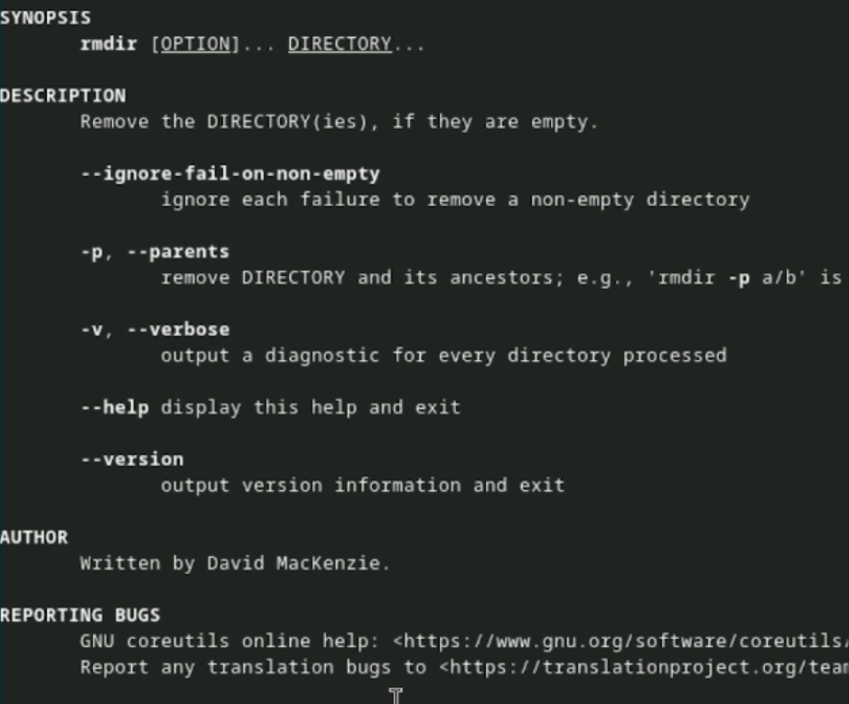{ #fig:013 width=70% }

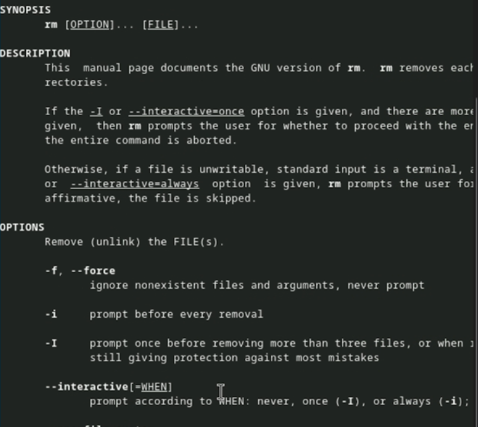{ #fig:014 width=70% }

# Выводы по проделанной работе

## Вывод

Мы приобрели практические навыки взаимодействия пользователя с системой посредством командной строки.
