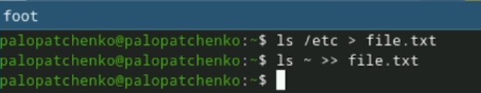
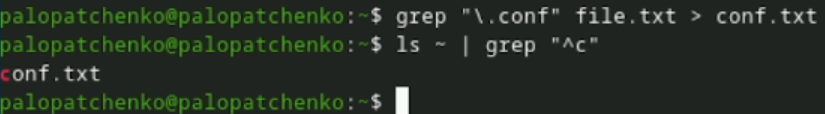
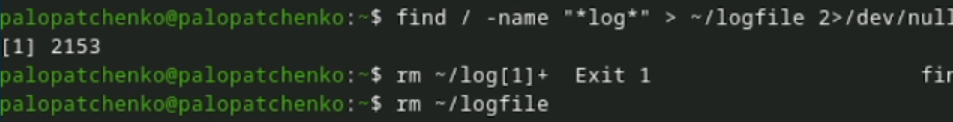
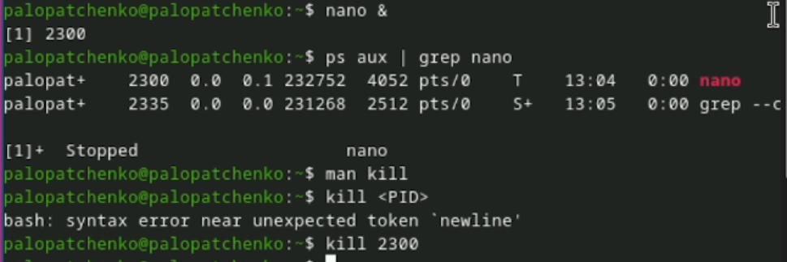
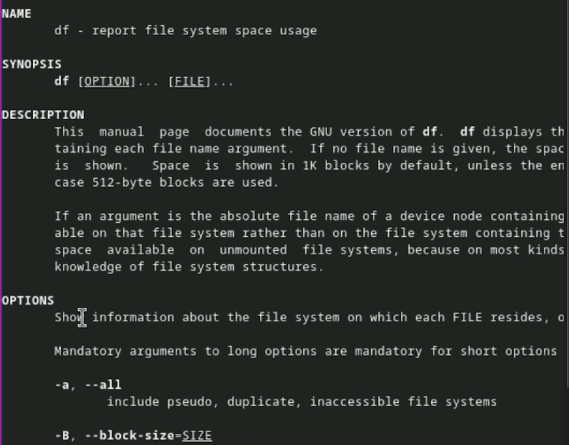
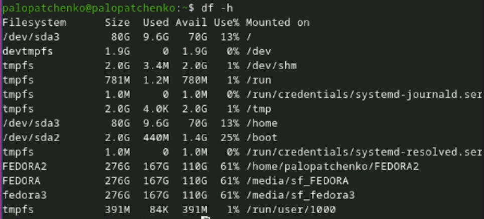
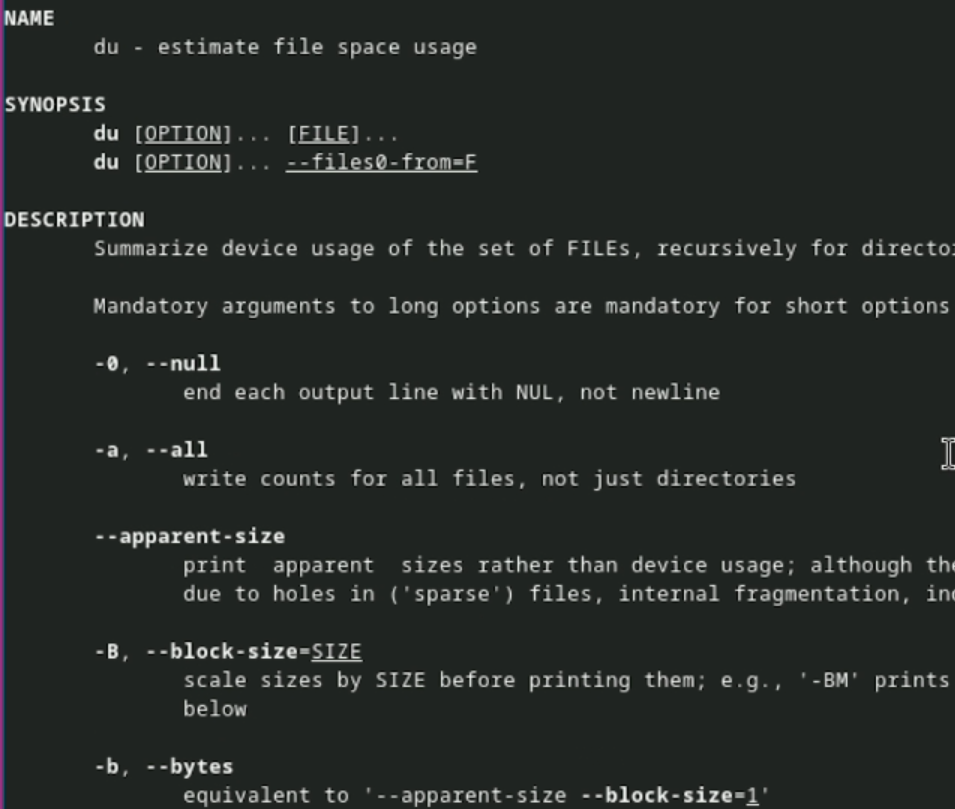
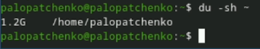
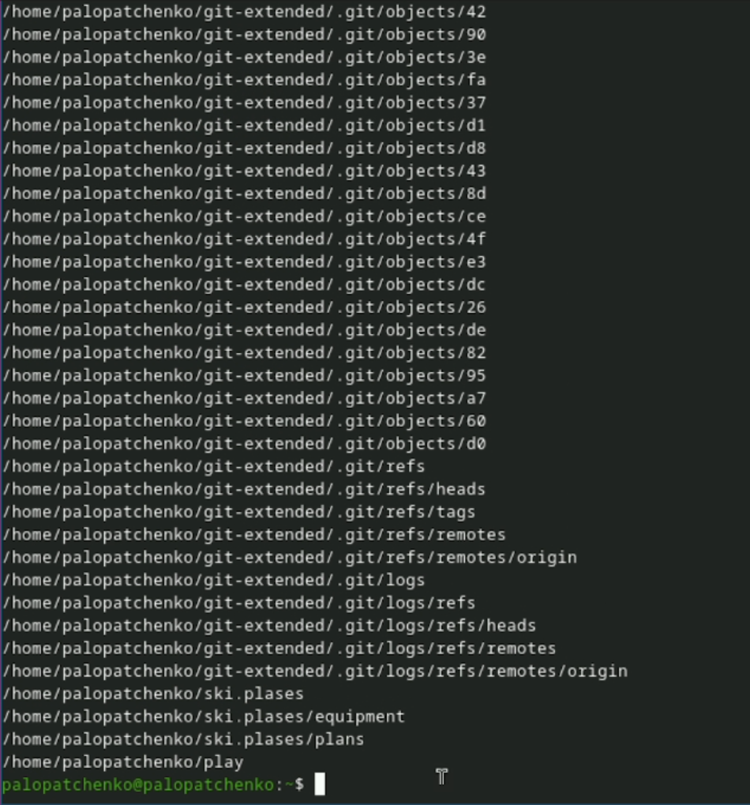

---
## Author
author:
  name: Лопатченко Полина Андреевна
  degrees: Студент
  orcid: 0000-0002-0877-7063
  email: 1032253529@rudn.ru
  affiliation:
    - name: Российский университет дружбы народов
      country: Российская Федерация
      postal-code: 117198
      city: Москва
      address: ул. Миклухо-Маклая, д. 6
## Title
title: Лабораторная работа №8
subtitle: Поиск файлов. Перенаправление ввода-вывода. Просмотр запущенных процессов
license: CC BY
date: 2026-03-30
date-format: "YYYY-MM-DD" # Example: 2025-09-06
---

# Информация

## Докладчик

:::::::::::::: {.columns align=center}
::: {.column width="70%"}

  * Лопатченко Полина Андреевна
  * Студент
  * НКАбд-04-25
  * Российский университет дружбы народов им. П. Лумумбы
  * [1032253529@rudn.ru](mailto:1032253529@rudn.ru)
  * <https://PALopatchenko-lab.github.io/ru/>

:::
::: {.column width="30%"}

:::
::::::::::::::

# Цели и задачи работы

## Цель лабораторной работы

Ознакомление с файловой системой Linux, её структурой, именами и содержанием каталогов. Приобретение практических навыков по применению команд для работы с файлами и каталогами, по управлению процессами, по проверке использования диска и обслуживанию файловой системы.

## Задачи лабораторной работы

1 Изучить перенаправление ввода-вывода

2 Изучить работу фильтров

3 Изучить команду поиска

4 Ознакомиться с управлением процессами

5 Ознакомиться с командами df du

# Процесс выполнения лабораторной работы

## Перенаправление ввода-вывода

{ #fig:001 height=70% width=70% }

## Команда поиска

{ #fig:003 height=70% width=70% }

## Управление процессами

{ #fig:005 height=70% width=70% }

## Управление процессами

{ #fig:006 height=70% width=70% }

## Команды df и du

{ #fig:007 height=70% width=70% }

## Команды df и du

{ #fig:008 height=70% width=70% }

## Команды df и du

{ #fig:009 height=70% width=70% }

## Команды df и du

{ #fig:010 height=70% width=70% }

## Команда поиска

{ #fig:011 height=70% width=70% }

# Выводы по проделанной работе

## Вывод

В данной работе мы ознакомились с инструментами поиска файлов и фильтрации текстовых данных. А также приобрели практические навыки по управлению процессами. 
