---
## Author
author:
  name: Лопатченко Полина Андреевна
  degrees: студент
  orcid: 0000-0002-0877-7063
  email: 1032253529@rudn.ru
  affiliation:
    - name: Российский университет дружбы народов
      country: Российская Федерация
      postal-code: 117198
      city: Москва
      address: ул. Миклухо-Маклая, д. 6
## Title
title: Лабораторная работа №9
subtitle: Командная оболочка Midnight Commander"
license: CC BY
date: 2026-04-08
date-format: "YYYY-MM-DD" # Example: 2025-09-06
---

# Информация

## Докладчик

:::::::::::::: {.columns align=center}
::: {.column width="70%"}

  * Лопатченко Полина Андреевна
  * студент
  * НКАбд-04-25
  * Российский университет дружбы народов им. П. Лумумбы
  * [1032253529@rudn.ru](mailto:1032253529@rudn.ru)
  * <https://PALopatchenko-lab.github.io/ru/>

:::
::: {.column width="30%"}

:::
::::::::::::::

# Вводная часть

# Цели и задачи работы

## Цель лабораторной работы

Ознакомление с файловой системой Linux, её структурой, именами и содержанием каталогов. Приобретение практических навыков по применению команд для работы с файлами и каталогами, по управлению процессами, по проверке использования диска и обслуживанию файловой системы.

## Задачи лабораторной работы

1 Изучить возможности Midnight Commander

2 Изучить редактор Midnight Commander

# Процесс выполнения лабораторной работы

## Работа с Midnight Commander

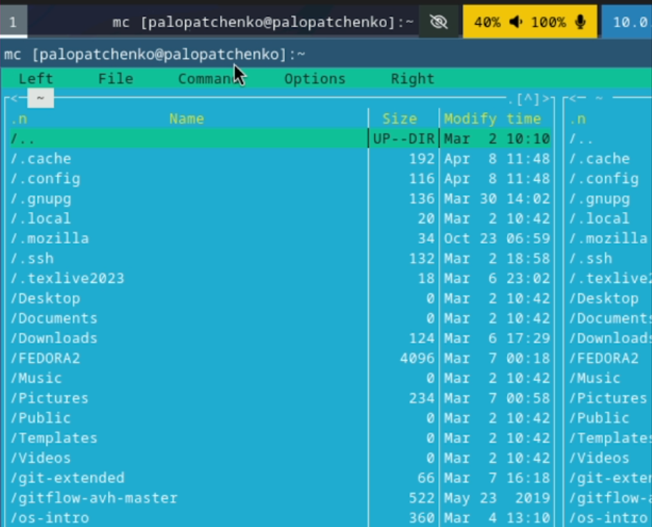{ #fig:001 width=70% height=70% }

## Работа с Midnight Commander

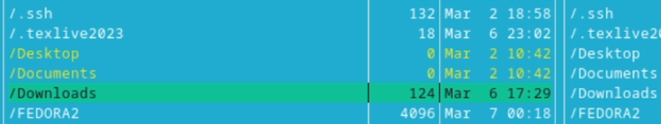{ #fig:002 width=70% height=70% }

## Работа с Midnight Commander

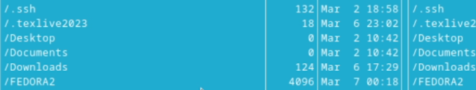{ #fig:003 width=70% height=70% }

## Работа с Midnight Commander

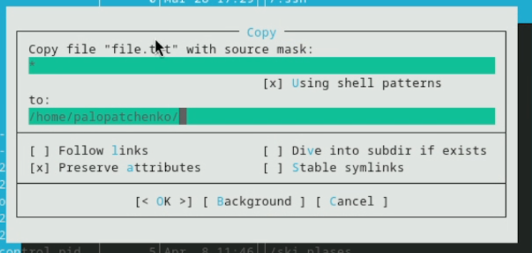{ #fig:004 width=70% height=70% }

## Работа с Midnight Commander

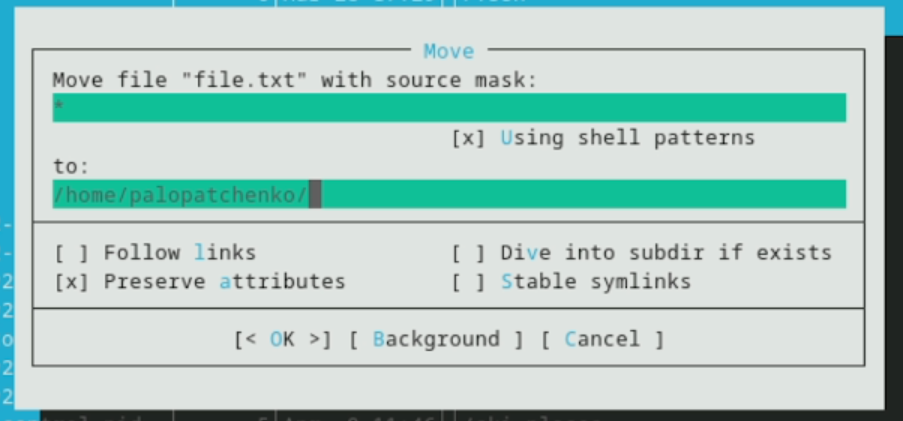{ #fig:005 width=70% height=70% }

## Работа с Midnight Commander

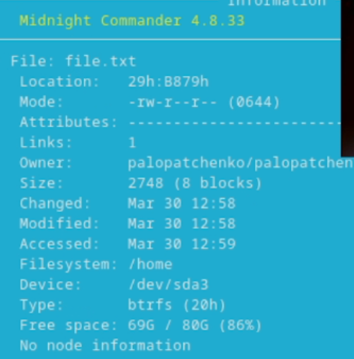{ #fig:006 width=70% height=70% }

## Работа с Midnight Commander

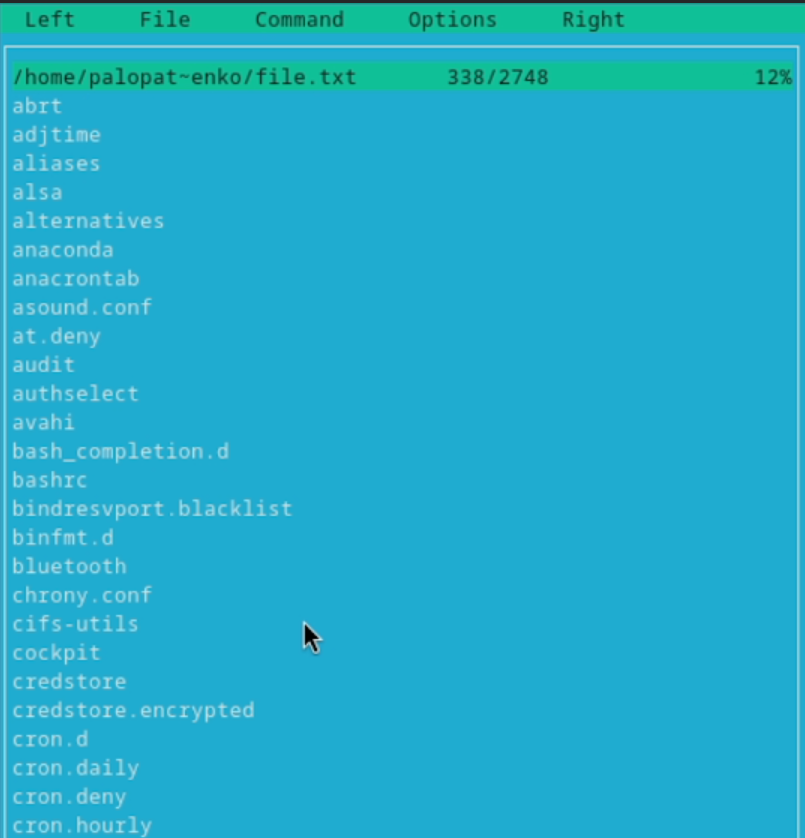{ #fig:007 width=70% height=70% }

## Работа с Midnight Commander

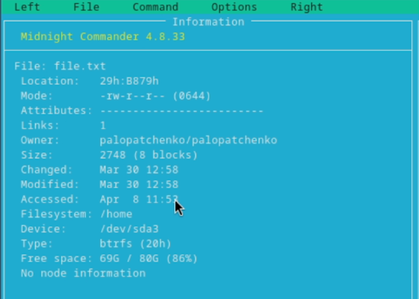{ #fig:008 width=70% height=70% }

## Работа с Midnight Commander

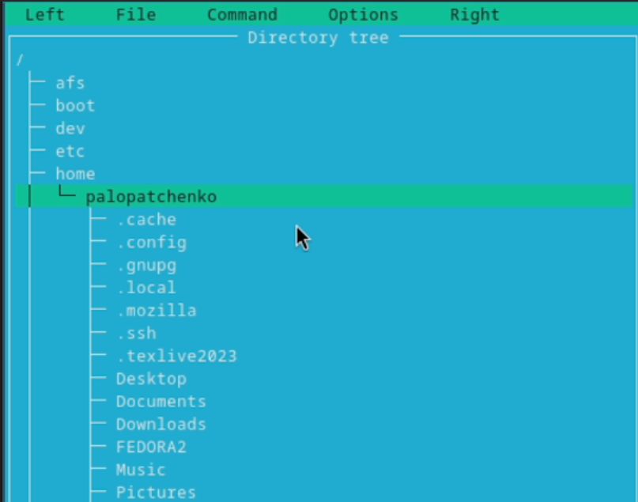{ #fig:009 width=70% height=70% }

## Работа с Midnight Commander

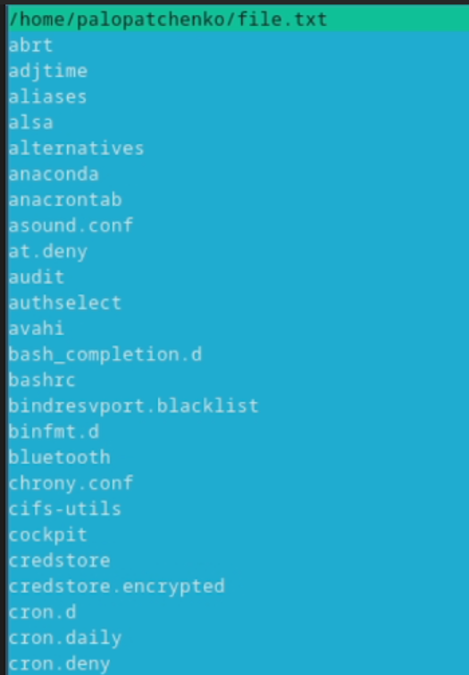{ #fig:010 width=70% height=70% }

## Работа с Midnight Commander

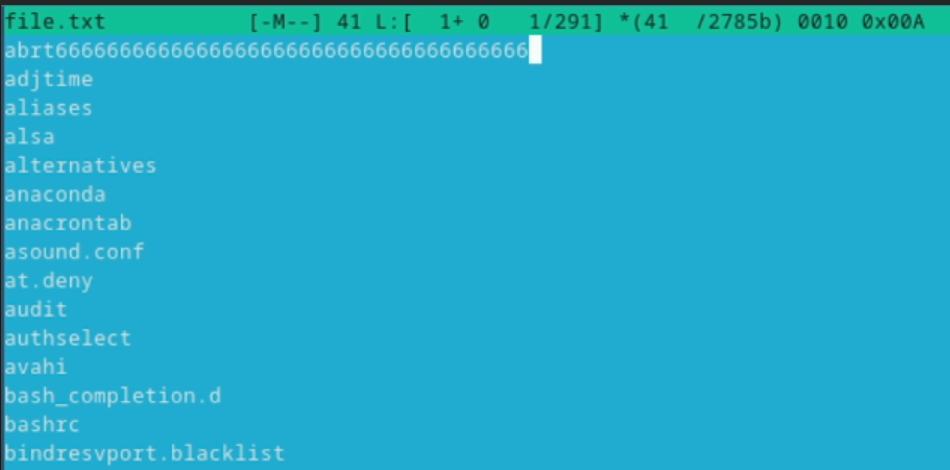{ #fig:011 width=70% height=70% }

## Работа с Midnight Commander

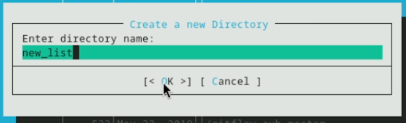{ #fig:012 width=70% height=70% }

## Работа с Midnight Commander

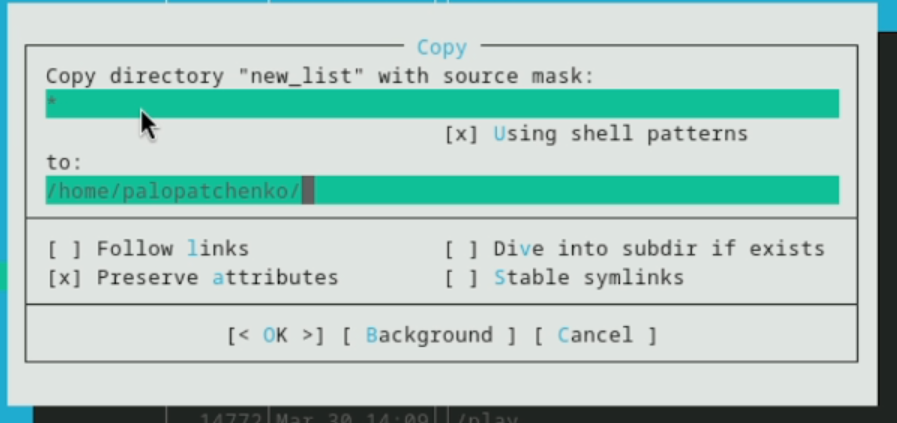{ #fig:013 width=70% height=70% }

## Работа с Midnight Commander

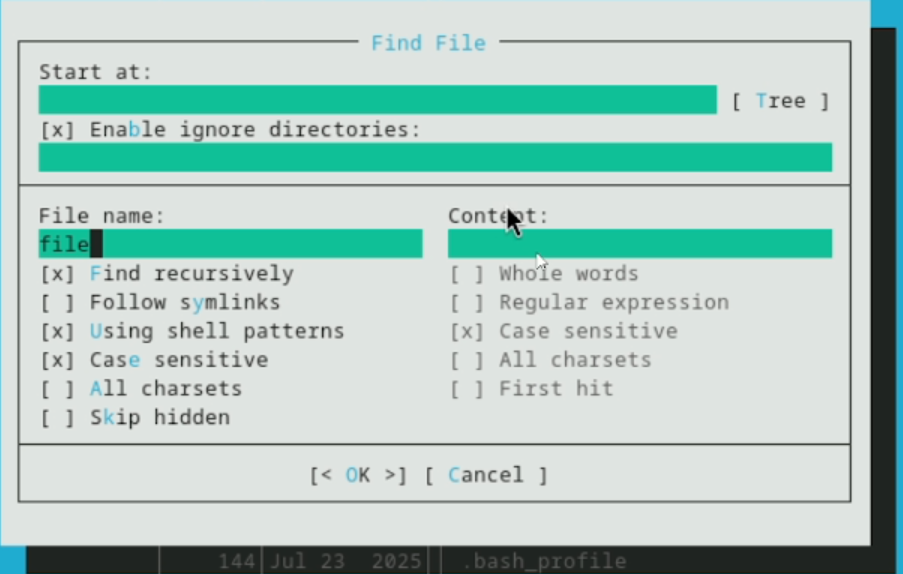{ #fig:014 width=70% height=70% }

## Работа с Midnight Commander

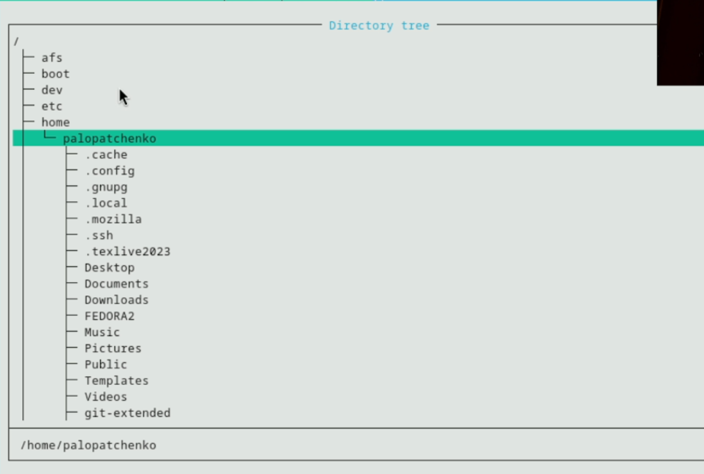{ #fig:016 width=70% height=70% }

## Работа с Midnight Commander

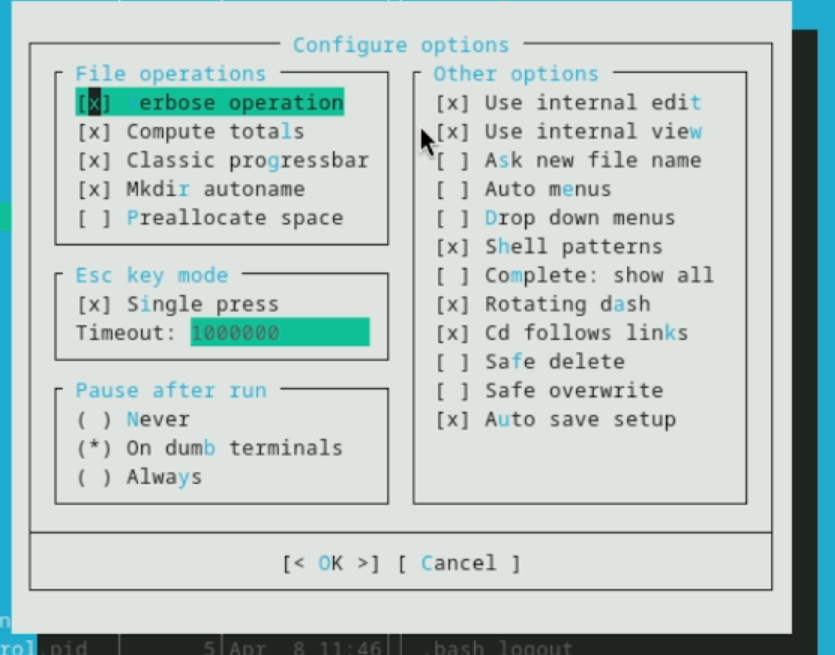{ #fig:019 width=70% height=70% }

## Работа с Midnight Commander

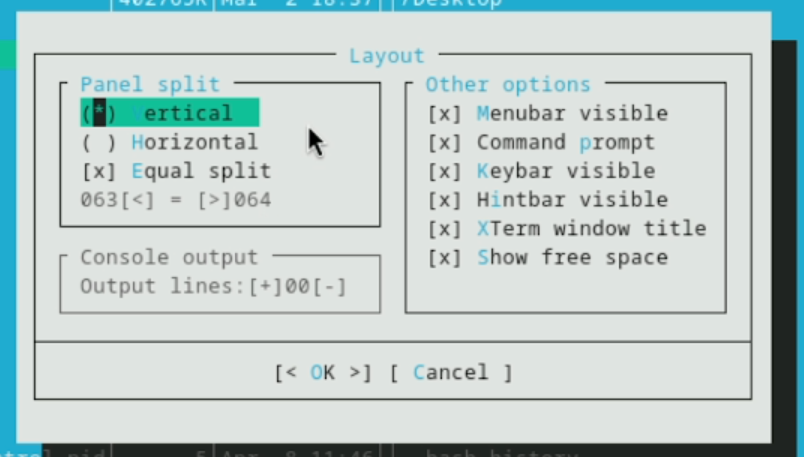{ #fig:020 width=70% height=70% }

## Работа с Midnight Commander

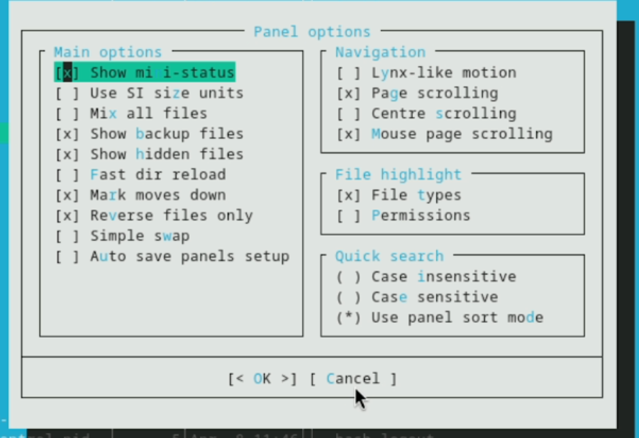{ #fig:021 width=70% height=70% }

## Работа с Midnight Commander

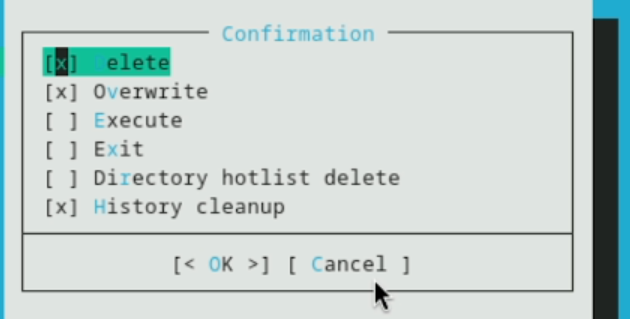{ #fig:022 width=70% height=70% }

## Работа с Midnight Commander

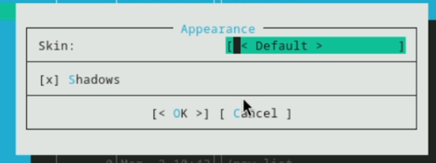{ #fig:023 width=70% height=70% }

## Работа с Midnight Commander

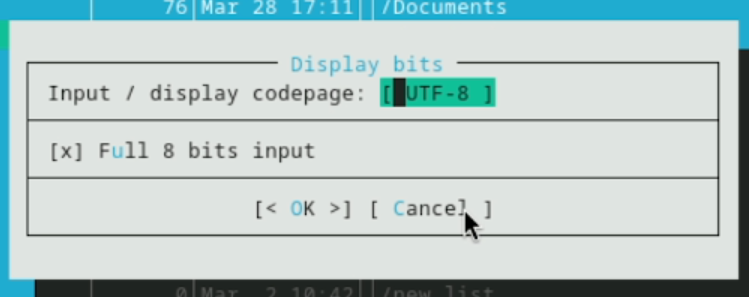{ #fig:024 width=70% height=70% }

## Работа с Midnight Commander

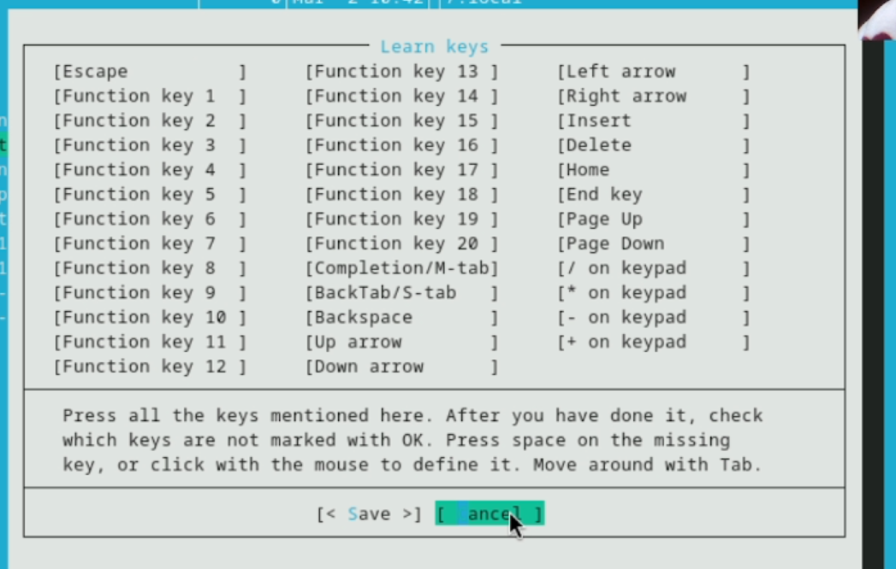{ #fig:025 width=70% height=70% }

## Работа с редактором Midnight Commander

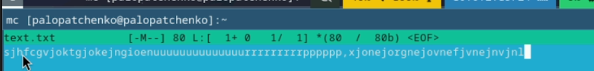{ #fig:026 width=70% height=70% }

## Работа с редактором Midnight Commander

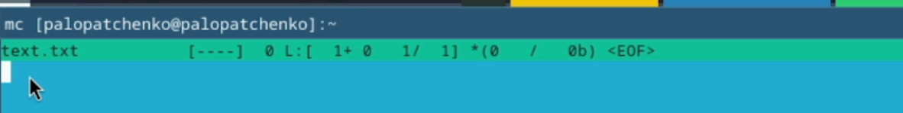{ #fig:027 width=70% height=70% }

## Работа с редактором Midnight Commander

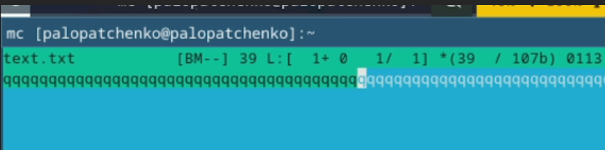{ #fig:028 width=70% height=70% }

## Работа с редактором Midnight Commander

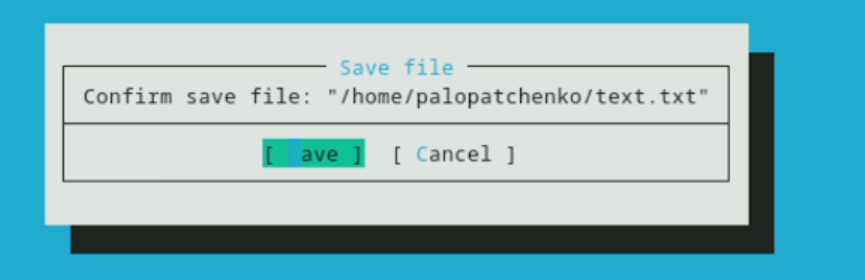{ #fig:029 width=70% height=70% }

## Работа с редактором Midnight Commander

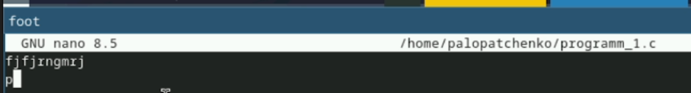{ #fig:033 width=70% height=70% }

## Работа с редактором Midnight Commander

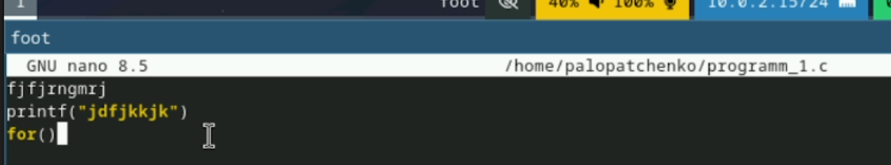{ #fig:034 width=70% height=70% }

# Выводы по проделанной работе

## Вывод

В данной работе мы ознакомились с инструментами поиска файлов и фильтрации текстовых данных. А также приобрели практические навыки по управлению процессами. 
