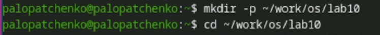
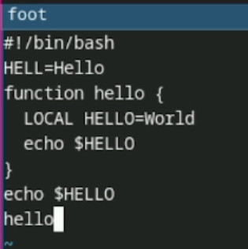
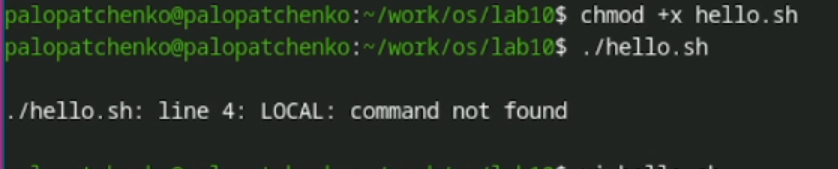
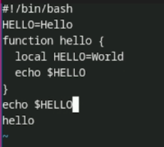
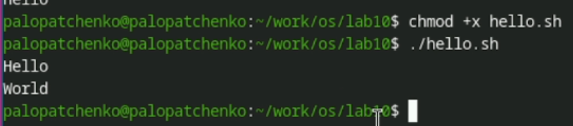

---
## Author
author:
  name: Лопатченко Полина Андреевна
  degrees: Студент
  orcid: 0000-0002-0877-7063
  email: 1032253529@rudn.ru
  affiliation:
    - name: Российский университет дружбы народов
      country: Российская Федерация
      postal-code: 117198
      city: Москва
      address: ул. Миклухо-Маклая, д. 6
## Title
title: Лабораторная работа №10
subtitle: Редактор Vi
license: CC BY
date: 2026-04-13
date-format: "2025-09-06" # Example: 2025-09-06
---

# Информация

## Докладчик

:::::::::::::: {.columns align=center}
::: {.column width="70%"}

  * Лопатченко Полина Андреевна
  * Студент
  * НКАбд-04-25
  * Российский университет дружбы народов им. П. Лумумбы
  * [1032253529@rudn.ru](mailto:1032253529@rudn.ru)
  * <https://PALopatchenko-lab.github.io/ru/>

:::
::: {.column width="30%"}

:::
::::::::::::::

# Цели и задачи работы

## Цель лабораторной работы

Познакомиться с операционной системой Linux. Получить практические навыки работы с редактором vi, установленным по умолчанию практически во всех дистрибутивах.

## Задачи лабораторной работы

1 Изучить возможности редактора Vi

# Процесс выполнения лабораторной работы

## Выполнение работы

{ #fig:001 width=70% height=70% }

## Выполнение работы

{ #fig:002 width=70% height=70% }

## Выполнение работы

{ #fig:003 width=70% height=70% }

## Выполнение работы

{ #fig:004 width=70% height=70% }

## Выполнение работы

{ #fig:005 width=70% height=70% }

# Выводы по проделанной работе

## Вывод

В ходе роботы мы получили практические навыки работы с редактором vi, установленным по умолчанию практически во всех дистрибутивах UNIX. А также освоили основные режимы и команды
