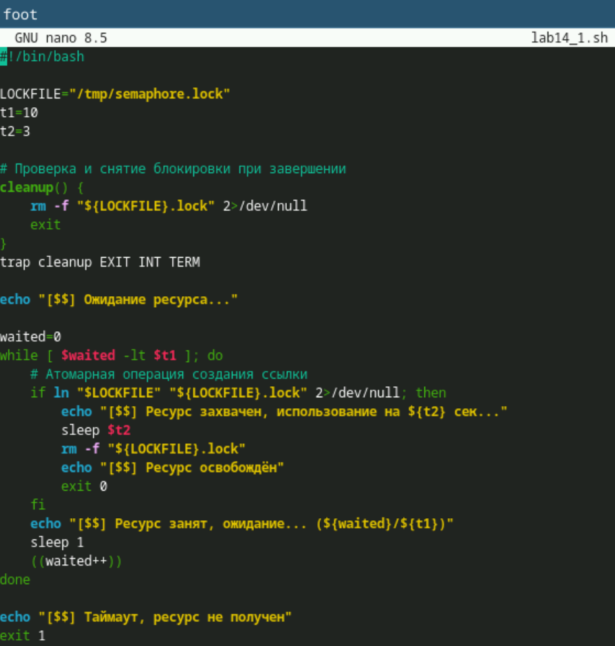
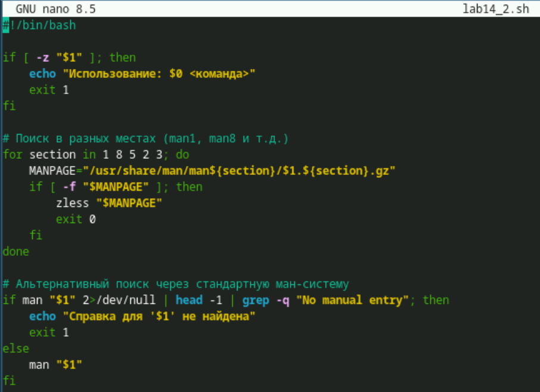
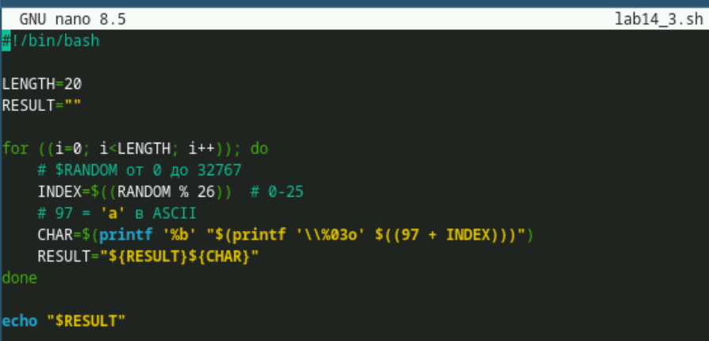

---
## Author
author:
  name: Лопатченко Полина Андреевна
  degrees: Студент
  orcid: 0000-0002-0877-7063
  email: 1032253529@rudn.ru
  affiliation:
    - name: Российский университет дружбы народов
      country: Российская Федерация
      postal-code: 117198
      city: Москва
      address: ул. Миклухо-Маклая, д. 6
## Title
title: Лабораторная работа №10
subtitle: Редактор Vi
license: CC BY
date: 2026-05-11
date-format: "YYYY-MM-DD" # Example: 2025-09-06
---
# Информация

## Докладчик

:::::::::::::: {.columns align=center}
::: {.column width="70%"}

  * Лопатченко Полина Андреевна
  * Студент
  * НКАбд-04-25
  * Российский университет дружбы народов им. П. Лумумбы
  * [1032253529@rudn.ru](1032253529@rudn.ru)
  * <https://PALopatchenko-lab.github.io/ru/>

:::
::: {.column width="30%"}


:::
::::::::::::::

# Цели и задачи работы

## Цель лабораторной работы

Изучить основы программирования в оболочке ОС UNIX. Научиться писать более сложные командные файлы с использованием логических управляющих конструкций и циклов

## Задачи лабораторной работы

1 Выполнить 3 задания

# Процесс выполнения лабораторной работы

## Выполнение работы

1. Написали командный файл, реализующий упрощённый механизм семафоров. Командный файл в течение некоторого времени t1 дожидается освобождения ресурса, выдавая об этом сообщение, а дождавшись его освобождения, использует его в течение некоторого времени t2<>t1 , также выдавая информацию о том, что ресурс используется соответствующим командным файлом (процессом).

## Выполнение работы

{ #fig:001 width=70% height=70%}

## Выполнение работы

2. Реализовали команду man с помощью командного файла. Изучили содержимое каталога ```/usr/share/man/man1``` . В нем находятся архивы текстовых файлов, содержащих справку по большинству установленных в системе программ и команд.

## Выполнение работы

{ #fig:002 width=70% height=70%}

## Выполнение работы

3. Написали командный файл, генерирующий случайную последовательность букв латинского алфавита

## Выполнение работы

{ #fig:003 width=70% height=70%}

# Выводы по проделанной работе

## Вывод

Изучили основы программирования в оболочке ОС UNIX. Научились писать более сложные командные файлы с использованием логических управляющих конструкций и циклов. 
