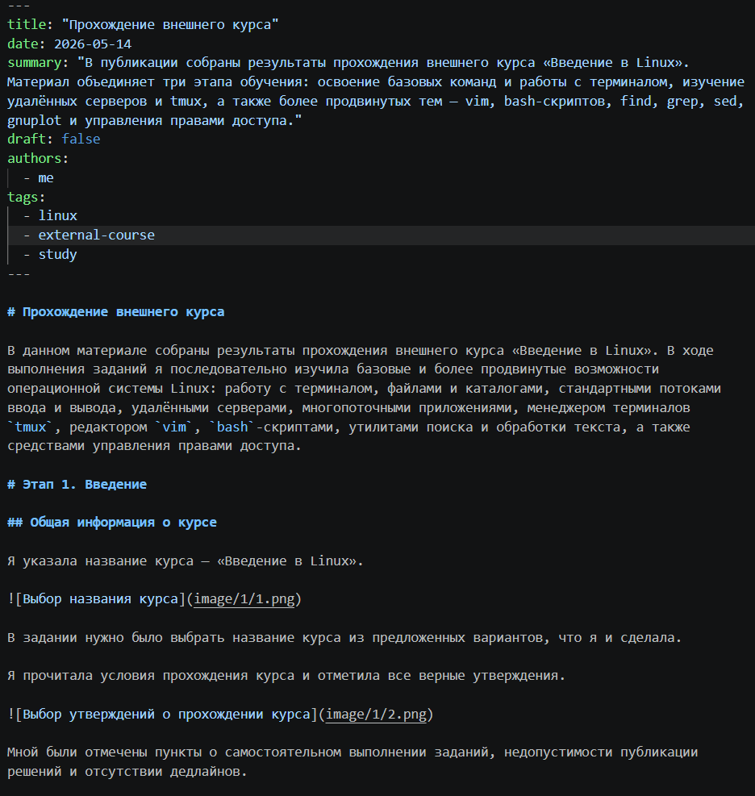
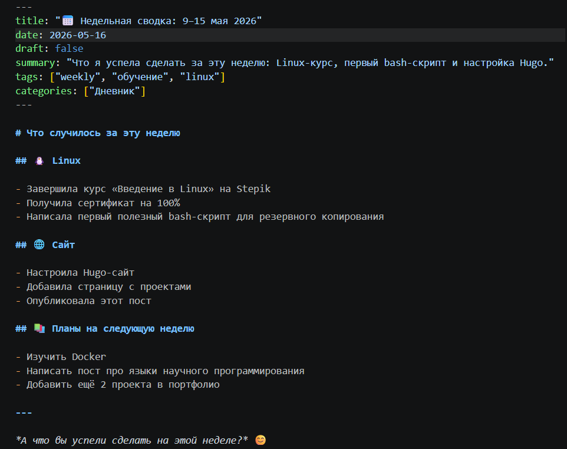

---
## Author
author:
  name: Лопатченко Полина Андреевна
  degrees: студент
  orcid: 0000-0002-0877-7063
  email: 10322253529@rudn.ru
  affiliation:
    - name: Российский университет дружбы народов
      country: Российская Федерация
      postal-code: 117198
      city: Москва
      address: ул. Миклухо-Маклая, д. 6

## Title
title: "5 этап проекта"
subtitle: "Выполнение 5 этапа проекта"
license: "CC BY"
---

# Цель работы

Добавить к сайту данные о себе.

# Выполнение работы

Заполняю файл с информацией о проекте.

{ #fig:001 width=70% height=70%}

Заполняю файл с текстом поста за события прошедшей недели.

{ #fig:002 width=70% height=70%}

Заполняю файл с текстом публикации про языки программирования.

{ #fig:003 width=70% height=70%}

Перекомпилирую сайт

# Выводы

Добавили к сайту данные о себе.
