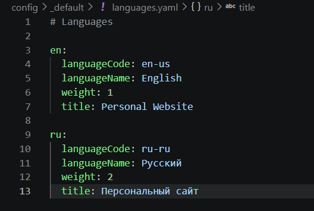
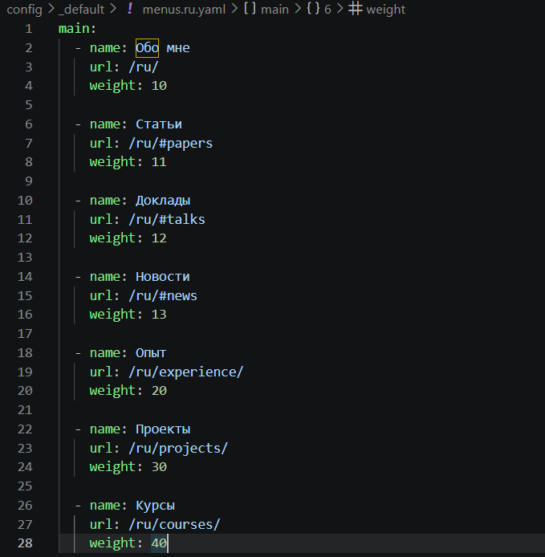
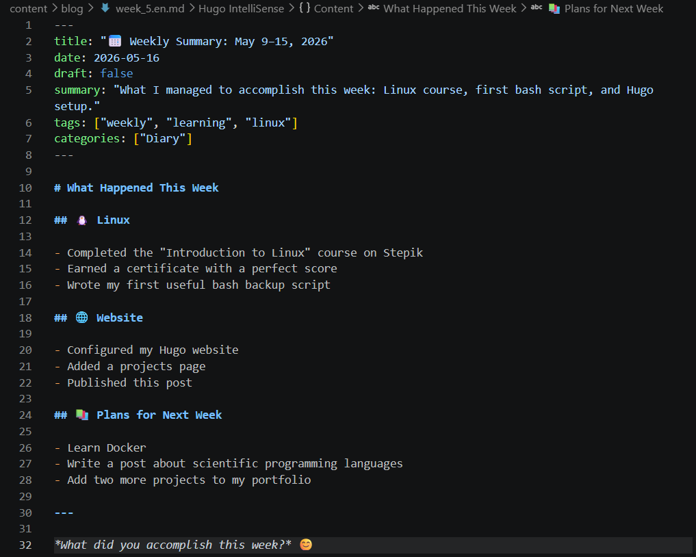

---
## Author
author:
  name: Лопатченко Полина Андреевна
  degrees: Студент
  orcid: 0000-0002-0877-7063
  email: 1032253529@rudn.ru
  affiliation:
    - name: Российский университет дружбы народов
      country: Российская Федерация
      postal-code: 117198
      city: Москва
      address: ул. Миклухо-Маклая, д. 6
## Title
title: 6 этап
subtitle: Выполнение 6 этапа.
license: CC BY
date: 2026-05-25
date-format: "2026-04-13" # Example: 2025-09-06
---
# Информация

## Докладчик

:::::::::::::: {.columns align=center}
::: {.column width="70%"}

  * Лопатченко Полина Андреевна
  * Студент
  * НКАбд-04-25
  * Российский университет дружбы народов им. П. Лумумбы
  * [1032253529@rudn.ru](1032253529@rudn.ru)
  * <https://PALopatchenko-lab.github.io/ru/>

:::
::: {.column width="30%"}

:::
::::::::::::::

# Цели и задачи

## Цель лабораторной работы

Добавить к сайту перевод.

# Выполнение лабораторной работы

## Файл с переводом меню

{ #fig:001 width=70% height=70%}

## Файл с переводом

{ #fig:002 width=70% height=70%}

## Папки с контентом

{ #fig:003 width=70% height=70%}

# Выводы

## Результаты выполнения лабораторной работы

Добавила к сайту данные о себе и настроила перевод на 2 языках.
